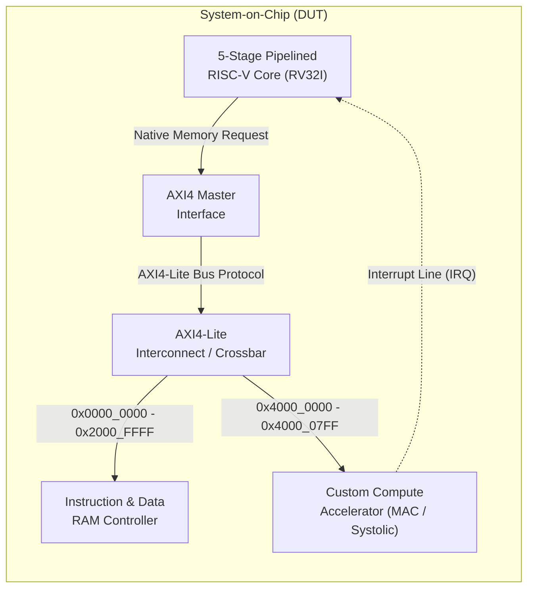
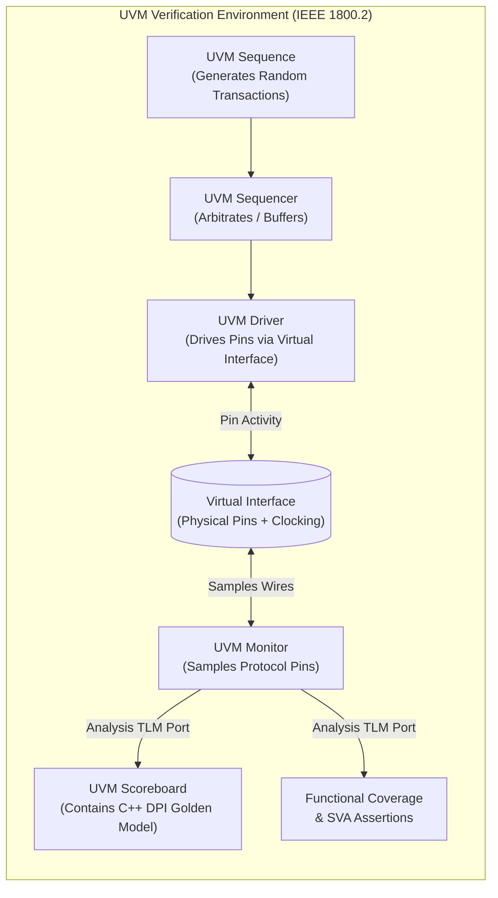

# 🏛️ Executive System Architecture & Top-Level Blueprint


> [!NOTE] **The Dual-Universe Concept**
> In cutting-edge silicon development, a project is divided into two equally sophisticated worlds:
> 1. **The Silicon World (DUT - Device Under Test)**: The actual synthesizable digital circuit that will be manufactured into physical silicon (the CPU, the Bus, the Memory, and the Accelerator).
> 2. **The Verification World (UVM Testbench)**: A high-level, object-oriented software test harness that wraps around the silicon model, injects random stimuli, checks math correctness, and measures coverage.

---

## 1. System-on-Chip (DUT) Block Breakdown



### Block 1: 5-Stage Pipelined RISC-V Core (RV32I)
- **Role**: The supervisor and orchestrator of the chip.
- **Specification**: Implements the standard open-source **RV32I Base Integer ISA** (32 general-purpose 32-bit registers `x0`-`x31`).
- **Microarchitecture**: Classic 5-stage RISC pipeline: Fetch (`IF`), Decode (`ID`), Execute (`EX`), Memory (`MEM`), Writeback (`WB`).
- **Special Features**:
  - **Hazard Detection Unit**: Freezes the pipeline when a "load-use" data dependency is detected.
  - **Data Forwarding Unit**: Teleports calculation results backwards from future pipeline stages to the ALU inputs, avoiding pipeline stalls.
  - **Interrupt Controller**: Listens for the `irq` pin from the accelerator to wake up or trigger an ISR (Interrupt Service Routine).
- 👉 Read the full deep-dive: [[02_Five_Stage_Pipelined_Core|5-Stage Pipelined Datapath]]

### Block 2: AXI4 Master Interface
- **Role**: The translator between the CPU and the system bus.
- When the CPU executes an instruction like `sw x5, 0(x10)` (Store Word), it emits simple native signals: `addr`, `wdata`, `we` (write enable).
- The **AXI4 Master Interface** translates this native request into compliant **AMBA AXI4-Lite** transactions across the 5 independent AXI channels (`AW`, `W`, `B`, `AR`, `R`).
- 👉 Read the full deep-dive: [[02_AXI4_Lite_Master_and_Slave_Design|AXI4-Lite Master Design]]

### Block 3: AXI4-Lite Interconnect (The Crossbar / Router)
- **Role**: The traffic controller of the chip.
- It examines the destination address (`AWADDR` or `ARADDR`) sent by the CPU and routes the transaction to the correct slave device:
  - If address is `< 0x4000_0000`: Route to the **RAM Controller**.
  - If address is between `0x4000_0000` and `0x4000_07FF`: Route to the **Custom Accelerator**.
- Ensures that transactions to different slaves do not collide and handles routing responses back to the master.
- 👉 Read the full deep-dive: [[01_AMBA_AXI4_Lite_Protocol_Deep_Dive|AMBA AXI4-Lite Protocol]]

### Block 4: Instruction & Data RAM Controller
- **Role**: Manages access to on-chip fast memory (SRAM / Scratchpad).
- Unified memory map holding both CPU program instructions (ROM/RAM) and data variables.
- Supports single-cycle synchronous read and byte-masked writes (`WSTRB`).

### Block 5: Custom Compute Accelerator (Domain-Specific Engine)
- **Role**: Offloads heavy matrix multiplication and tensor arithmetic from the CPU.
- Contains an internal **bank of Multiply-Accumulate (MAC) units** or a **$2 \times 2$ / $4 \times 4$ Systolic Array**.
- Controlled through Memory-Mapped I/O (**MMIO**) registers:
  - Base Address: `0x4000_0000`.
  - The CPU configures input matrix addresses, matrix size, and issues a `START` command.
  - When finished, the accelerator pulls an **IRQ** wire high to notify the CPU.
- 👉 Read the full deep-dive: [[01_Custom_Compute_Accelerator_Concepts|Custom Compute Accelerator Concepts]]

---

## 2. Complete SoC Memory Map

In Computer Architecture, **Memory-Mapped I/O (MMIO)** means that hardware peripherals (like our accelerator) are accessed using normal memory read and write instructions. The CPU simply reads or writes to a specific physical address number!

| Address Range | Size | Region Name | Description | Access Permissions |
| :--- | :---: | :--- | :--- | :---: |
| `0x0000_0000 - 0x0000_FFFF` | 64 KB | **Instruction Boot ROM / RAM** | Holds the compiled RISC-V program code (hex instructions). | Read / Execute |
| `0x2000_0000 - 0x2000_FFFF` | 64 KB | **Data Scratchpad SRAM** | General data variables, stack memory, input/output arrays. | Read / Write |
| `0x4000_0000 - 0x4000_00FF` | 256 B | **Accelerator CSRs** | Control & Status Registers (Command, Status, Pointers, Dimensions). | Read / Write |
| `0x4000_0100 - 0x4000_07FF` | 1.75 KB | **Accelerator Local Buffer** | High-speed on-chip SRAM for storing Input Matrices A, B and Result Matrix C. | Read / Write |

---

## 3. UVM Verification Environment Breakdown



### Component 1: UVM Sequence & Sequencer
- Generates thousands of randomized transactions: random instruction streams, random matrix data, unexpected backpressure delays (holding `READY` low).
- Drives the system into extreme corner-cases that human engineers would never think of testing manually.

### Component 2: UVM Driver
- Receives abstract transaction objects (e.g. `write_matrix(A, B)`) from the sequence and drives the physical pins of the `axi_if` interface in accordance with AMBA AXI timing rules.

### Component 3: Virtual Interface (`vif`)
- The bridge connecting the dynamic object-oriented SystemVerilog testbench to the static, synthesizable hardware module (`DUT`).
- Uses **Clocking Blocks** to eliminate Verilog delta-cycle race conditions.

### Component 4: UVM Monitor
- Passively listens to the bus wires. It never drives signals.
- Decodes raw pin wiggles back into high-level transactions and broadcasts them out via **TLM (Transaction Level Modeling) Analysis Ports**.

### Component 5: UVM Scoreboard & C++ DPI Golden Predictor
- Receives the transactions from the Monitor.
- Passes the same input data to an independent, high-level **Golden Mathematical Model** written in C++ (via SystemVerilog DPI-C).
- Compares the hardware output vs. the C++ mathematical truth.
- If a single bit differs, it flags an immediate `uvm_error` with cycle-accurate debug information.

### Component 6: Functional Coverage & SystemVerilog Assertions (SVA)
- **SVA**: Embedded formal properties checking protocol laws on every single clock cycle (e.g. *Once VALID is asserted, it MUST stay high until READY is asserted*).
- **Coverage**: Quantitative proof (0% to 100%) that every instruction, hazard path, matrix dimension, and buffer state was thoroughly exercised.

---

## 4. End-to-End Walkthrough: Multiplying Two Matrices

To see how everything fits together, follow this real execution trace:

1. **Boot**: The RISC-V CPU powers up. Program Counter ($\text{PC}$) starts at `0x0000_0000`.
2. **CPU Fetch**: CPU fetches instructions from the Instruction RAM over the AXI bus.
3. **Firmware Setup**: The C program running on the CPU writes the input matrices $A$ and $B$ into memory address `0x4000_0100` via AXI store instructions (`SW`).
4. **Accelerator Trigger**: CPU writes `0x0000_0001` (`START = 1`) to register `0x4000_0000` (`CTRL`).
5. **Compute**: The custom accelerator takes over! Its internal FSM asserts `BUSY`, streams rows from Matrix A and columns from Matrix B through its 4 parallel MAC units, and accumulates the dot products in Q8.8 fixed-point format.
6. **Interrupt**: After 32 clock cycles, computation finishes. The accelerator sets `DONE = 1` in `STATUS` register and pulls the `irq` pin to `1`.
7. **CPU Readout**: The RISC-V CPU interrupts its main loop, branches to the interrupt service routine, reads the completed matrix from `0x4000_0400`, and verifies the checksum.
8. **Verification Audit**: Simultaneously, the UVM Monitor captured every single byte transferred over the bus. The C++ Golden Model calculated the exact same matrix multiplication independently. The Scoreboard compares both outputs and reports:
   ```
   [SCOREBOARD MATCH] Addr: 0x4000_0400 | HW Output: 0x0045_2000 | Golden: 0x0045_2000 | STATUS: PASS
   ```

---

## Next Steps
Now let's examine the detailed architecture and microarchitecture of each component:
- 👉 [[01_RISCV_RV32I_Architecture|Pillar 1: RISC-V RV32I Architecture & Instruction Formats]]
