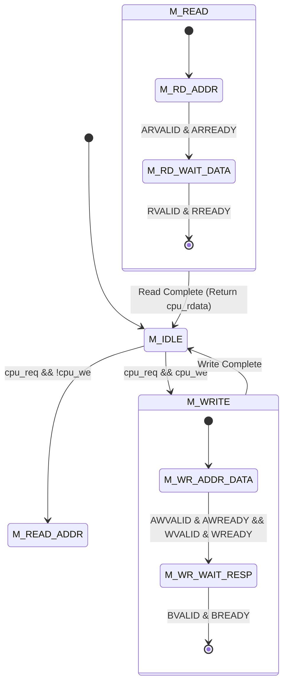

# AXI4-Lite Master & Slave Implementation Microarchitecture

> [!TIP] **How Hardware State Machines Communicate**
> While software developers use function calls like `send_data(addr, val)`, hardware designs use **Finite State Machines (FSMs)**.
> The CPU tells the Master FSM: "I want to write `0x1234` to address `0x4000_0000`."
> The Master FSM moves through electronic states, asserting pins in the exact sequence demanded by the AXI specification.

---

## 1. AXI4-Lite Master Controller FSM

The CPU core provides simple, single-cycle memory requests:
- `cpu_req`: 1 when CPU wants to do a load or store.
- `cpu_we`: 1 for Write (`SW`), 0 for Read (`LW`).
- `cpu_addr`: 32-bit address.
- `cpu_wdata`: 32-bit data to store.

The **AXI4-Lite Master Bridge** captures these signals and drives the AXI bus:



### Complete Synthesizable Master Controller (SystemVerilog)

```systemverilog
module axi_lite_master (
 input logic clk,
 input logic rst_n,
 
 // CPU Native Interface
 input logic cpu_req,
 input logic cpu_we,
 input logic [31:0] cpu_addr,
 input logic [31:0] cpu_wdata,
 input logic [3:0] cpu_strb,
 output logic [31:0] cpu_rdata,
 output logic cpu_ready,
 output logic cpu_err,
 
 // AXI4-Lite Master Bus Interface
 output logic [31:0] m_axi_awaddr,
 output logic m_axi_awvalid,
 input logic m_axi_awready,
 
 output logic [31:0] m_axi_wdata,
 output logic [3:0] m_axi_wstrb,
 output logic m_axi_wvalid,
 input logic m_axi_wready,
 
 input logic [1:0] m_axi_bresp,
 input logic m_axi_bvalid,
 output logic m_axi_bready,
 
 output logic [31:0] m_axi_araddr,
 output logic m_axi_arvalid,
 input logic m_axi_arready,
 
 input logic [31:0] m_axi_rdata,
 input logic [1:0] m_axi_rresp,
 input logic m_axi_rvalid,
 output logic m_axi_rready
);

 typedef enum logic [2:0] {
 IDLE = 3'b000,
 WRITE_TX = 3'b001,
 WRITE_RESP = 3'b010,
 READ_ADDR = 3'b011,
 READ_DATA = 3'b100
 } state_t;

 state_t state, next_state;
 logic aw_done, w_done;

 // Sequential State Transition
 always_ff @(posedge clk or negedge rst_n) begin
 if (!rst_n) begin
 state <= IDLE;
 aw_done <= 1'b0;
 w_done <= 1'b0;
 end else begin
 state <= next_state;
 
 // Track address and data handshakes independently
 if (state == WRITE_TX) begin
 if (m_axi_awvalid && m_axi_awready) aw_done <= 1'b1;
 if (m_axi_wvalid && m_axi_wready) w_done <= 1'b1;
 end else begin
 aw_done <= 1'b0;
 w_done <= 1'b0;
 end
 end
 end

 // Next State Logic & Outputs
 always_comb begin
 next_state = state;
 m_axi_awvalid = 1'b0;
 m_axi_wvalid = 1'b0;
 m_axi_bready = 1'b0;
 m_axi_arvalid = 1'b0;
 m_axi_rready = 1'b0;
 cpu_ready = 1'b0;
 cpu_err = 1'b0;
 
 m_axi_awaddr = cpu_addr;
 m_axi_wdata = cpu_wdata;
 m_axi_wstrb = cpu_strb;
 m_axi_araddr = cpu_addr;
 cpu_rdata = m_axi_rdata;

 case (state)
 IDLE: begin
 if (cpu_req) begin
 if (cpu_we) next_state = WRITE_TX;
 else next_state = READ_ADDR;
 end
 end

 WRITE_TX: begin
 m_axi_awvalid = !aw_done;
 m_axi_wvalid = !w_done;
 
 // When both address and data are accepted, wait for response
 if ((aw_done || (m_axi_awvalid && m_axi_awready)) &&
 (w_done || (m_axi_wvalid && m_axi_wready))) begin
 next_state = WRITE_RESP;
 end
 end

 WRITE_RESP: begin
 m_axi_bready = 1'b1;
 if (m_axi_bvalid) begin
 cpu_ready = 1'b1;
 cpu_err = (m_axi_bresp != 2'b00); // Check for SLVERR or DECERR
 next_state = IDLE;
 end
 end

 READ_ADDR: begin
 m_axi_arvalid = 1'b1;
 if (m_axi_arready) begin
 next_state = READ_DATA;
 end
 end

 READ_DATA: begin
 m_axi_rready = 1'b1;
 if (m_axi_rvalid) begin
 cpu_ready = 1'b1;
 cpu_err = (m_axi_rresp != 2'b00);
 next_state = IDLE;
 end
 end
 endcase
 end

endmodule
```

---

## 2. AXI4-Lite Slave Peripheral Architecture

Every slave peripheral (our RAM Controller and Custom Accelerator) must obey the slave handshake requirements:

1. **Accepting Writes**: When `AWVALID` and `WVALID` are presented, the slave asserts `AWREADY` and `WREADY` to latch the address and data.
2. **Generating Write Response**: Once the write completes in local registers, the slave asserts `BVALID = 1` with `BRESP = 2'b00 (OKAY)`. It drops `BVALID` only after the master asserts `BREADY = 1`.
3. **Accepting Reads**: When `ARVALID` is presented, the slave asserts `ARREADY`, fetches the requested register data, and presents `RDATA` with `RVALID = 1` and `RRESP = 2'b00`.

---

## 3. The Interconnect Crossbar: Address Decoding Logic

The **Interconnect** is a hardware router that examines `AWADDR` or `ARADDR` to direct traffic:

```
[ Master: CPU ] 
 |
 v
+-----------------------------+
| Interconnect Decoder |
+-----------------------------+
 | | \
 v v v
[ 0x0000_0000 ] [ 0x4000_0000 ] [ Any Unmapped Addr ]
 RAM Controller Accelerator DECERR Generator
```

```systemverilog
always_comb begin
 // Default: unmapped address (generate DECERR)
 sel_ram = 1'b0;
 sel_accel = 1'b0;
 sel_error = 1'b0;

 if (addr >= 32'h0000_0000 && addr <= 32'h2000_FFFF) begin
 sel_ram = 1'b1;
 end else if (addr >= 32'h4000_0000 && addr <= 32'h4000_07FF) begin
 sel_accel = 1'b1;
 end else begin
 sel_error = 1'b1; // Trigger DECERR!
 end
end
```

---

## Next Steps
Now that the AXI bus and memory routing are fully architected, we arrive at the core compute engine of our project:
 [[01_Custom_Compute_Accelerator_Concepts|Proceed to Pillar 3: Custom Compute Accelerator Concepts]]
