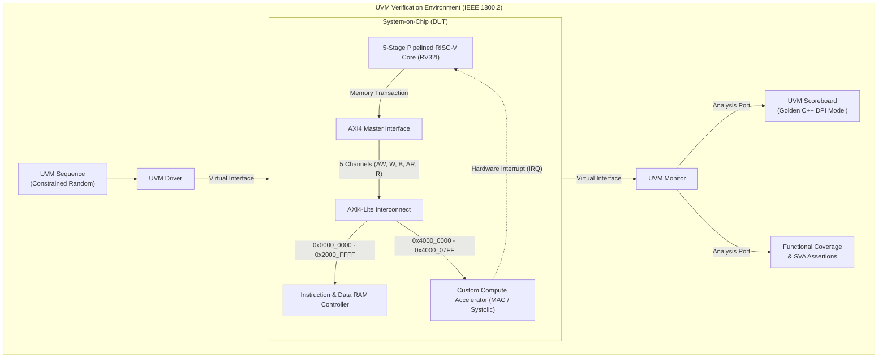

# Heterogeneous RISC-V SoC with AMBA AXI4-Lite & Custom Matrix Accelerator

[](https://standards.ieee.org/ieee/1800/6817/)
[](https://standards.ieee.org/ieee/1800.2/7140/)
[](https://riscv.org/technical/specifications/)
[](https://developer.arm.com/architectures/system-architectures/amba)
[](LICENSE)

An industrial-grade **Heterogeneous System-on-Chip (SoC)** and **Constrained-Random UVM Verification Environment** designed from scratch in SystemVerilog.

The system integrates a synthesizable **5-stage pipelined RV32I RISC-V Core** with a **Domain-Specific Hardware Accelerator (4-MAC Matrix Engine)** over an industry-standard **AMBA AXI4-Lite interconnect**, verified using an automated **IEEE 1800.2 UVM testbench** powered by a **C++ DPI-C Golden Predictor**.

---

## Executive System Architecture




---

## Key Architectural Features

### 1. 5-Stage Pipelined RISC-V Core (RV32I)
- **Classic RISC Pipeline**: Instruction Fetch (`IF`), Decode (`ID`), Execute (`EX`), Memory (`MEM`), and Writeback (`WB`).
- **Hazard Detection Unit**: Detects load-use dependencies and injects a 1-cycle bubble/stall by freezing `PC` and `IF/ID` registers.
- **ALU Forwarding Unit**: Resolves Read-After-Write (RAW) data hazards via `EX/MEM -> EX` and `MEM/WB -> EX` bypass paths without stalling execution.
- **Branch Prediction & Recovery**: Static Predict-Not-Taken prediction with single-cycle dual-stage pipeline flushes on mispredicted branches.

### 2. AMBA AXI4-Lite Interconnect Fabric
- **Full Compliance**: Strictly adheres to the ARM AMBA AXI4-Lite specification with 5 independent channels (`AW`, `W`, `B`, `AR`, `R`).
- **Rigorous Handshake Logic**: Complies with the `VALID`/`READY` transfer contract (zero `VALID` drops before handshake).
- **Address Crossbar & Decoding**: Routes transactions to RAM or Accelerator based on memory-mapped offsets, generating `DECERR` on unmapped access.

### 3. Custom Compute Accelerator (Edge-AI / DSP)
- **Datapath**: 4 parallel Multiply-Accumulate (MAC) units calculating dot products in Q8.8 signed fixed-point precision with saturation clamping.
- **Memory-Mapped CSRs**: Control (`0x00`), Status (`0x04`), Dimension (`0x08`), and Source/Destination Pointers (`0x10-0x18`).
- **Asynchronous Co-Processing**: Computes matrix multiplication in parallel and raises a dedicated `irq` pin to alert the CPU upon completion.

### 4. IEEE 1800.2 UVM Verification Environment
- **Race-Condition Immunity**: Parameterized `axi_if` with clocking blocks using `#1step` sampling skews.
- **SystemVerilog Assertions (SVA)**: Concurrent formal checkers verifying protocol stability, valid holding, and absence of unknown `'X'` states.
- **C++ DPI Golden Model**: High-level reference matrix multiplier imported via DPI-C into `soc_scoreboard` for cycle-accurate mathematical checks.
- **Coverage Closure**: Functional covergroups and cross-coverage models targeting 100% closure across instruction types, hazards, bus latency, and matrix dimensions.


---

## Hardware Simulation & Verification Scorecard

All modules across the CPU core, AXI bus, matrix accelerator, and top-level SoC have been verified with automated self-checking testbenches:

### 1. Complete SoC Integration Simulation (100% Pass)


### 2. RV32I Core Execution & Unit Verification (100% Pass)


### 3. Control Unit & Branch Condition Logic (100% Pass)


---

## Repository Directory Structure

```
.
├── docs/                       # Complete Obsidian Engineering Vault & Documentation
│   ├── 00 - Foundations & Orientation/
│   ├── 01 - Architecture & RTL/
│   ├── 02 - AMBA AXI Interconnect/
│   ├── 03 - Custom Compute Accelerator/
│   ├── 04 - SystemVerilog & UVM Verification/
│   ├── 05 - Step-by-Step Execution Plan/
│   ├── 06 - Toolchain & Simulation Labs/
│   └── assets/
├── rtl/                        # Synthesizable Hardware Silicon Code
│   ├── core/                   # 5-stage RV32I Processor RTL
│   ├── bus/                    # AMBA AXI4-Lite Master, Slave & Interconnect
│   ├── accel/                  # Custom 4-MAC Accelerator & CSRs
│   └── top/                    # Top-level SoC wrapper (soc_top.sv)
├── verif/                      # UVM Verification Environment
│   ├── tb/                     # Parameterized interfaces (axi_if.sv) & testbenches
│   ├── seq/                    # UVM sequence items and constrained-random sequences
│   ├── agent/                  # UVM drivers, monitors, and sequencers
│   ├── scb/                    # UVM scoreboard and golden_accel.cpp (DPI-C)
│   ├── cov/                    # Functional coverage subscriber & covergroups
│   ├── env/                    # UVM environment class
│   └── tests/                  # UVM test library
├── firmware/                   # Bare-metal C programs & Linker scripts
└── scripts/                    # Automation Makefiles & Python regression runners
```

---

## Documentation & Obsidian Vault

All detailed engineering guides, theory, and hardware blueprints are organized inside the `docs/` folder:
- Open the `docs/` folder in **Obsidian** to explore the interconnected technical notes and visual architecture maps.
- Master Dashboard: [`docs/00 - Foundations & Orientation/00_MOC_Master_Dashboard.md`](docs/00%20-%20Foundations%20&%20Orientation/00_MOC_Master_Dashboard.md).

---

## Toolchain Support
- **Siemens QuestaSim / ModelSim**
- **Synopsys VCS**
- **Verilator & C++ Testbenches**
- **Icarus Verilog + GTKWave**
- **RISC-V GNU Toolchain (`riscv64-unknown-elf-gcc`)**

---

## License
This project is licensed under the MIT License - see the [LICENSE](LICENSE) file for details.
