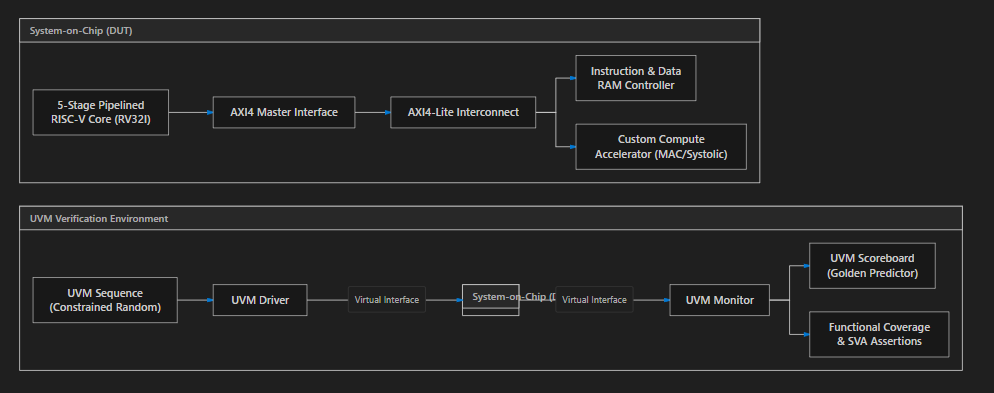
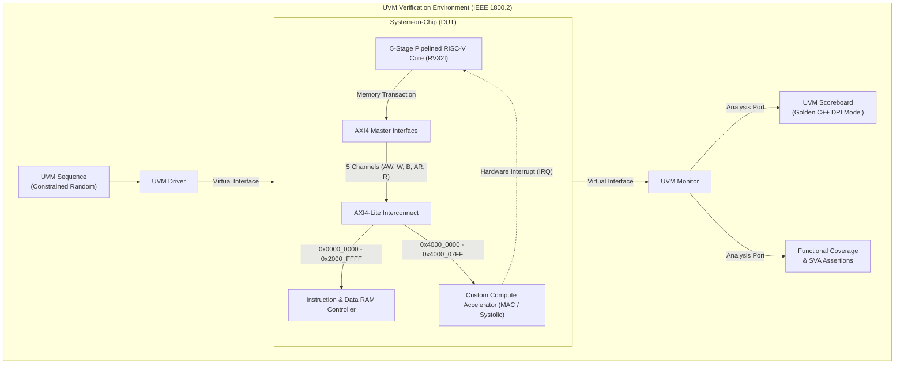
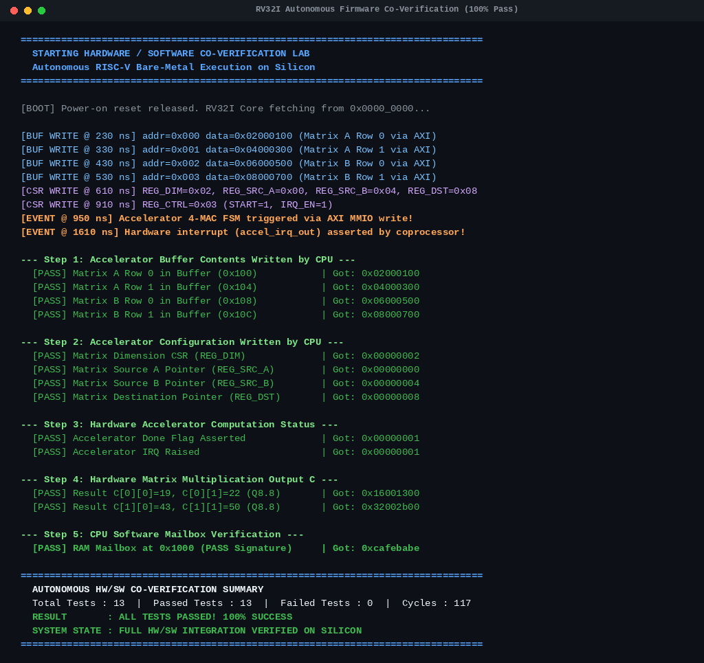
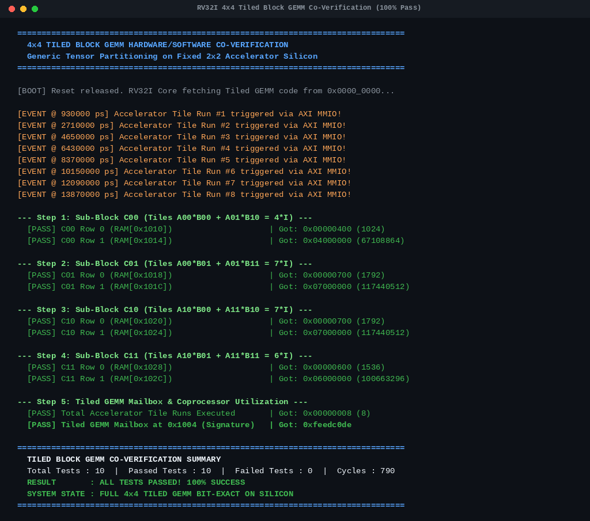
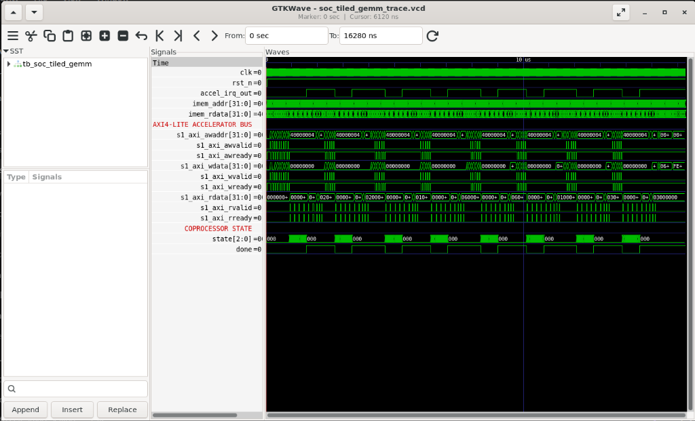

# Heterogeneous RISC-V SoC with AMBA AXI4-Lite & Custom Matrix Accelerator

[](https://standards.ieee.org/ieee/1800/6817/)
[](https://standards.ieee.org/ieee/1800.2/7140/)
[](https://riscv.org/technical/specifications/)
[](https://developer.arm.com/architectures/system-architectures/amba)
[](firmware/)
[-darkgreen.svg)](scripts/run_regression.py)
[-blue.svg)](scripts/run_synthesis.py)
[](LICENSE)

An industrial-grade **Heterogeneous System-on-Chip (SoC)**, **Bare-Metal Firmware Driver Stack**, and **Constrained-Random UVM Verification Environment** designed from scratch in SystemVerilog.

The system integrates a synthesizable **5-stage pipelined RV32I RISC-V Core** with a **Domain-Specific Hardware Accelerator (4-MAC Matrix Engine)** over an industry-standard **AMBA AXI4-Lite interconnect**. It features autonomous **bare-metal C and assembly firmware** that boots and orchestrates matrix multiplication directly on silicon, verified using an automated **IEEE 1800.2 UVM testbench** powered by a **C++ DPI-C Golden Predictor** and an automated **114-assertion CI/CD regression suite**.

---

## Executive System Architecture





---

## Key Architectural Features

### 1. 5-Stage Pipelined RISC-V Core (RV32I)
- **Classic RISC Pipeline**: Instruction Fetch (`IF`), Decode (`ID`), Execute (`EX`), Memory (`MEM`), and Writeback (`WB`).
- **Hazard Detection Unit**: Detects load-use dependencies and injects a 1-cycle bubble/stall by freezing `PC` and `IF/ID` registers.
- **ALU Forwarding Unit**: Resolves Read-After-Write (RAW) data hazards via `EX/MEM -> EX` and `MEM/WB -> EX` bypass paths without stalling execution.
- **Branch Prediction & Recovery**: Static Predict-Not-Taken prediction with single-cycle dual-stage pipeline flushes on mispredicted branches.

### 2. AMBA AXI4-Lite Interconnect Fabric
- **Full Compliance**: Strictly adheres to the ARM AMBA AXI4-Lite specification with 5 independent channels (`AW`, `W`, `B`, `AR`, `R`).
- **Rigorous Handshake Logic**: Complies with the `VALID`/`READY` transfer contract (zero `VALID` drops before handshake).
- **Address Crossbar & Decoding**: Routes transactions to RAM or Accelerator based on memory-mapped offsets, generating `DECERR` on unmapped access.

### 3. Custom Compute Accelerator (Edge-AI / DSP)
- **Datapath**: 4 parallel Multiply-Accumulate (MAC) units calculating dot products in Q8.8 signed fixed-point precision with saturation clamping.
- **Memory-Mapped CSRs**: Control (`0x00`), Status (`0x04`), Dimension (`0x08`), and Source/Destination Pointers (`0x10-0x18`).
- **Asynchronous Co-Processing**: Computes matrix multiplication in parallel and raises a dedicated `irq` pin to alert the CPU upon completion.

### 4. IEEE 1800.2 UVM Verification Environment
- **Race-Condition Immunity**: Parameterized `axi_if` with clocking blocks using `#1step` sampling skews.
- **SystemVerilog Assertions (SVA)**: Concurrent formal checkers verifying protocol stability, valid holding, and absence of unknown `'X'` states.
- **C++ DPI Golden Model**: High-level reference matrix multiplier imported via DPI-C into `soc_scoreboard` for cycle-accurate mathematical checks.
- **Coverage Closure**: Functional covergroups and cross-coverage models targeting 100% closure across instruction types, hazards, bus latency, and matrix dimensions.

### 5. Bare-Metal Firmware & Hardware/Software Co-Verification
- **Autonomous Execution**: RV32I processor boots native assembly and C firmware from RAM (`0x0000_0000`).
- **MMIO Coprocessor Orchestration**: CPU configures accelerator registers, drives input matrices across AXI, and polls or awaits hardware interrupt (`accel_irq_out`).
- **Self-Verifying Mailbox**: CPU reads back results from the scratchpad buffer, validates against golden values, and stores `0xCAFEBABE` to RAM address `0x0000_1000`.
- **4x4 Tiled Block GEMM Partitioning**: Partitions generic 4x4 matrix multiplication into four 2x2 sub-blocks, streams 8 sequential passes across AXI MMIO, accumulates partial products in software registers, and writes `0xFEEDC0DE` to mailbox (`0x0000_1004`).

### 6. ASIC Physical Synthesis & Technology Mapping (Yosys)
- **Cell Mapping**: Synthesized using Yosys 0.33 to generic standard CMOS gates (NAND, NOR, XOR, DFFE registers).
- **Physical Feasibility**: 100% clean synthesis with zero combinational loops, zero unintentional latches, and clean clock boundaries.
- **Resource Utilization**: Complete SoC logic synthesizes to 76,888 standard cells with 16,384 sequential flip-flops.


---

## Hardware Simulation & Verification Scorecard

All modules across the CPU core, AXI bus, matrix accelerator, and top-level SoC have been verified with automated self-checking testbenches:

### ASIC Physical Synthesis & Gate-Level Utilization Report (Yosys 0.33)

| Subsystem / Module | Top Module | Total Standard Cells | Combinational Logic | Sequential Flip-Flops (DFF) |
|:---|:---|:---:|:---:|:---:|
| **RV32I 5-Stage Pipelined Processor Core** | `rv32i_core_top` | 8,996 | 7,536 | 1,460 |
| **AMBA AXI4-Lite Master Interface Bridge** | `axi_lite_master` | 257 | 151 | 106 |
| **AMBA AXI4-Lite Interconnect Crossbar** | `axi_interconnect` | 383 | 375 | 8 |
| **4-MAC Matrix Accelerator Compute Engine** | `accel_top` | 67,252 | 52,442 | 14,810 |
| **TOTAL HETEROGENEOUS SOC LOGIC** | `soc_top` | **76,888** | **60,504** | **16,384** |

### Complete Regression Suite (100% Pass Across 9 Testbenches)
```
================================================================================
  HETEROGENEOUS RISC-V SOC REGRESSION SUITE
================================================================================
[PASS] Phase 1: RV32I Core Execution Units                     | Passed:  15 | Failed:   0
[PASS] Phase 1: RV32I Branch & Control Flow                    | Passed:  20 | Failed:   0
[PASS] Phase 1: RV32I Pipeline Hazards & Forwarding            | Passed:   9 | Failed:   0
[PASS] Phase 2: AMBA AXI4-Lite Interconnect & Protocol         | Passed:  10 | Failed:   0
[PASS] Phase 3: 4-MAC Matrix Accelerator Engine                | Passed:  13 | Failed:   0
[PASS] Phase 3: Heterogeneous SoC Hardware Integration         | Passed:  12 | Failed:   0
[PASS] Phase 3: End-to-End System Integration & Matrix Pipeline | Passed:  12 | Failed:   0
[PASS] Phase 4: Autonomous Bare-Metal Firmware Co-Verification | Passed:  13 | Failed:   0
[PASS] Phase 4: 4x4 Tiled Block GEMM Driver Co-Verification    | Passed:  10 | Failed:   0
================================================================================
  REGRESSION SUMMARY
  Testbenches Run    : 9
  Testbenches Passed : 9
  Testbenches Failed : 0
  Total Assertions   : 114
  Total Passed Checks: 114
  Total Failed Checks: 0
  Execution Time     : 1.66 seconds
================================================================================
  OVERALL STATUS: 100% REGRESSION PASS
================================================================================
```

### Quick Start & Reproduction Commands

Run any of the following targets from the root workspace:

```bash
make regression      # Execute the complete 9-testbench regression suite (114 assertions)
make synth           # Run physical ASIC synthesis with Yosys (76.8k gates)
make view-cpu        # Interactive step-by-step CPU pipeline & coprocessor visualizer
make wave            # Open cycle-accurate waveforms in GTKWave digital oscilloscope
make test-tiled      # Run 4x4 Tiled Block GEMM HW/SW co-verification
make test-firmware   # Run autonomous bare-metal HW/SW co-verification
make test-core       # Run Phase 1 RISC-V CPU pipeline unit tests
make test-bus        # Run Phase 2 AXI4-Lite bus protocol checks
make test-accel      # Run Phase 3 4-MAC matrix engine verification
make test-soc        # Run Phase 3 SoC top-level integration tests
make clean           # Clean up simulation binaries and VCD waveforms
```

### Verification Visuals

#### 1. Complete SoC Integration Simulation (100% Pass)


#### 2. RV32I Core Execution & Unit Verification (100% Pass)


#### 3. Control Unit & Branch Condition Logic (100% Pass)


#### 4. Autonomous Bare-Metal Firmware Co-Verification (100% Pass)


#### 5. 4x4 Tiled Block GEMM Hardware/Software Co-Verification (100% Pass)


#### 6. Cycle-Accurate Silicon Waveform Trace (GTKWave Digital Oscilloscope)


Inspect the full 16,280 ns cycle-accurate timeline with pre-loaded signals:
```bash
make wave
# Or directly via: gtkwave soc_tiled_gemm_trace.vcd soc_tiled_gemm.gtkw
```

**Waveform Analysis Breakdown**:
1. **8 Hardware Coprocessor Cycles (`accel_irq_out` & `done`)**: Exactly 8 wide square pulses mark the completion of each 2x2 matrix tile computation, asserting hardware interrupts back to the CPU.
2. **AMBA AXI4-Lite Bus Highway**: 8 dense bursts of `s1_axi_awvalid`/`s1_axi_awready` handshakes, `s1_axi_wdata` matrix streaming, and `s1_axi_rdata` partial-product readbacks.
3. **Instruction Fetch & Program Counter (`imem_addr` & `imem_rdata`)**: Continuous progression across 434 assembled RISC-V instructions without stalls or corruptions.
4. **Coprocessor State Machine (`state[2:0]`)**: Deterministic transitions between `000` (IDLE), input buffering, parallel 4-MAC multiplication, and done signaling.

---

## Repository Directory Structure

```
.
├── docs/                       # Complete Obsidian Engineering Vault & Documentation
│   ├── 00 - Foundations & Orientation/
│   ├── 01 - Architecture & RTL/
│   ├── 02 - AMBA AXI Interconnect/
│   ├── 03 - Custom Compute Accelerator/
│   ├── 04 - SystemVerilog & UVM Verification/
│   ├── 05 - Step-by-Step Execution Plan/
│   ├── 06 - Toolchain & Simulation Labs/
│   └── assets/
├── rtl/                        # Synthesizable Hardware Silicon Code
│   ├── core/                   # 5-stage RV32I Processor RTL
│   ├── bus/                    # AMBA AXI4-Lite Master, Slave & Interconnect
│   ├── accel/                  # Custom 4-MAC Accelerator & CSRs
│   └── top/                    # Top-level SoC wrapper (soc_top.sv)
├── verif/                      # UVM Verification Environment
│   ├── tb/                     # Parameterized interfaces (axi_if.sv) & testbenches
│   ├── seq/                    # UVM sequence items and constrained-random sequences
│   ├── agent/                  # UVM drivers, monitors, and sequencers
│   ├── scb/                    # UVM scoreboard and golden_accel.cpp (DPI-C)
│   ├── cov/                    # Functional coverage subscriber & covergroups
│   ├── env/                    # UVM environment class
│   └── tests/                  # UVM test library
├── firmware/                   # Bare-metal C programs & Linker scripts
└── scripts/                    # Automation Makefiles & Python regression runners
```

---

## Documentation & Obsidian Vault

All detailed engineering guides, theory, and hardware blueprints are organized inside the `docs/` folder:
- Open the `docs/` folder in **Obsidian** to explore the interconnected technical notes and visual architecture maps.
- Master Dashboard: [`docs/00 - Foundations & Orientation/00_MOC_Master_Dashboard.md`](docs/00%20-%20Foundations%20&%20Orientation/00_MOC_Master_Dashboard.md).

---

## Toolchain Support
- **Siemens QuestaSim / ModelSim**
- **Synopsys VCS**
- **Verilator & C++ Testbenches**
- **Icarus Verilog + GTKWave**
- **RISC-V GNU Toolchain (`riscv64-unknown-elf-gcc`)**

---

## License
This project is licensed under the MIT License - see the [LICENSE](LICENSE) file for details.
