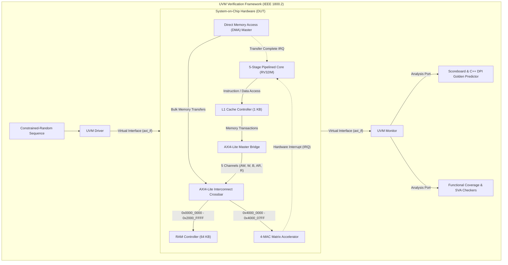

# Heterogeneous RISC-V SoC with AMBA AXI4-Lite Interconnect and Matrix Accelerator

[](https://standards.ieee.org/ieee/1800/6817/)
[](https://standards.ieee.org/ieee/1800.2/7140/)
[](https://riscv.org/technical/specifications/)
[](https://developer.arm.com/architectures/system-architectures/amba)
[](firmware/)
[-darkgreen.svg)](scripts/run_regression.py)
[-blue.svg)](scripts/run_synthesis.py)
[](LICENSE)

An open-source, synthesizable Heterogeneous System-on-Chip (SoC) architecture, bare-metal firmware driver stack, and constrained-random Universal Verification Methodology (UVM) test environment designed in SystemVerilog.

The system integrates a 5-stage pipelined RISC-V RV32IM processor core with a dedicated 4-MAC matrix coprocessor over an ARM AMBA AXI4-Lite interconnect bus. The platform executes autonomous bare-metal C and assembly firmware, validated through an IEEE 1800.2 UVM verification environment, SystemVerilog Assertions (SVA), a C++ DPI-C golden reference model, and a 12-testbench automated regression test suite.

---

## Table of Contents

- [Project Overview](#project-overview)
- [System Architecture](#system-architecture)
- [Hardware Subsystems](#hardware-subsystems)
- [Memory Map and Register Specifications](#memory-map-and-register-specifications)
- [System Requirements and Prerequisites](#system-requirements-and-prerequisites)
- [Installation and Setup](#installation-and-setup)
- [Quick Start Guide](#quick-start-guide)
- [Verification Suite and Simulation](#verification-suite-and-simulation)
- [Waveform Analysis and Debugging](#waveform-analysis-and-debugging)
- [ASIC Physical Synthesis Report](#asic-physical-synthesis-report)
- [Repository Structure](#repository-structure)
- [Technical Documentation Vault](#technical-documentation-vault)
- [License and Attribution](#license-and-attribution)

---

## Project Overview

Modern computing workloads in edge machine learning and digital signal processing demand efficient vector and matrix arithmetic. General-purpose embedded microcontrollers spend substantial execution time and energy running multi-nested loops for dot-product accumulation in software.

This project addresses computational efficiency by coupling a standard RISC-V core with a specialized hardware accelerator over an industry-standard AMBA bus.

### Core Objectives and Design Philosophy

- **Synthesizable Hardware Design**: Every RTL module is written in standard SystemVerilog (IEEE 1800), verified with open-source tools (Icarus Verilog, Verilator), and synthesized to standard CMOS cell libraries using Yosys.
- **Protocol Compliance**: Bus transfers strictly obey ARM AMBA AXI4-Lite specifications with complete valid-ready handshake integrity.
- **Hardware and Software Co-Design**: Autonomous bare-metal firmware boots from RAM, programs accelerator control registers, streams matrix tiles, and responds to hardware interrupt signals.
- **Rigorous Verification**: All components are validated via self-checking testbenches, SVA protocol checkers, and an IEEE 1800.2 UVM environment backed by a C++ DPI-C mathematical golden reference.

---

## System Architecture

The following block diagram illustrates the hardware dataflow and the verification harness. The processor coordinates memory transactions and coprocessor workloads across the AMBA AXI4-Lite crossbar interconnect.



```mermaid
flowchart TB
    subgraph DUT["System-on-Chip Hardware (DUT)"]
        CPU["5-Stage Pipelined Core (RV32IM)"] -->|"Instruction / Data Access"| L1["L1 Cache Controller (1 KB)"]
        L1 -->|"Memory Transactions"| AXI_M["AXI4-Lite Master Bridge"]
        DMA["Direct Memory Access (DMA) Master"] -->|"Bulk Memory Transfers"| BUS
        AXI_M -->|"5 Channels (AW, W, B, AR, R)"| BUS["AXI4-Lite Interconnect Crossbar"]
        BUS -->|"0x0000_0000 - 0x2000_FFFF"| RAM["RAM Controller (64 KB)"]
        BUS -->|"0x4000_0000 - 0x4000_07FF"| ACC["4-MAC Matrix Accelerator"]
        ACC -.->|"Hardware Interrupt (IRQ)"| CPU
        DMA -.->|"Transfer Complete IRQ"| CPU
    end

    subgraph UVM["UVM Verification Framework (IEEE 1800.2)"]
        SEQ["Constrained-Random Sequence"] --> DRV["UVM Driver"]
        DRV -->|"Virtual Interface (axi_if)"| DUT
        DUT -->|"Virtual Interface (axi_if)"| MON["UVM Monitor"]
        MON -->|"Analysis Port"| SCB["Scoreboard & C++ DPI Golden Predictor"]
        MON -->|"Analysis Port"| COV["Functional Coverage & SVA Checkers"]
    end
```

---

## Hardware Subsystems

### 1. RISC-V RV32IM 5-Stage Pipelined Processor Core

The core implements the complete unprivileged RV32I base integer instruction set along with the standard RV32M integer multiplication and division extension.

- **Pipeline Stages**: Instruction Fetch (`IF`), Instruction Decode / Register Read (`ID`), Execute / ALU (`EX`), Memory Access (`MEM`), and Register Writeback (`WB`).
- **Hazard Detection Unit**: Identifies load-use data dependencies and injects a single-cycle stall bubble by disabling program counter and `IF/ID` pipeline register updates.
- **ALU Data Forwarding Unit**: Resolves Read-After-Write (RAW) data hazards through `EX/MEM -> EX` and `MEM/WB -> EX` bypass multiplexers, eliminating stalls for register dependencies.
- **Branch Prediction and Recovery**: Implements static Predict-Not-Taken logic with single-cycle two-stage pipeline flushes upon mispredicted branch execution.
- **RV32M Hardware Multiplier and Divider**: Single-cycle signed and unsigned 32-bit multiplier supporting `MUL`, `MULH`, `MULHSU`, and `MULHU`. Multi-cycle iterative non-restoring hardware divider and remainder engine supporting `DIV`, `DIVU`, `REM`, and `REMU` with divide-by-zero detection and signed overflow protection.

### 2. L1 Hardware Cache Controller

- **Structure**: 1 KB direct-mapped on-chip SRAM cache (64 cache lines, 16 bytes per line, 4 words per line).
- **Hit Path**: Single-cycle tag comparison, valid check, and hit detection.
- **Line Refill Engine**: 4-word burst refill over the AXI bus upon read misses.
- **Coherence Policy**: Write-through cache architecture with write-allocate semantics.
- **Memory-Mapped I/O Bypass**: Automatic detection of non-cacheable peripheral ranges (`0x4000_0000` and above), routing control and peripheral access directly to the bus.

### 3. AMBA AXI4-Lite Interconnect Fabric

- **Five Independent Channels**: Write Address (`AW`), Write Data (`W`), Write Response (`B`), Read Address (`AR`), and Read Data (`R`).
- **Protocol Adherence**: Strict adherence to the standard ARM AXI4-Lite handshake contract: `VALID` signals remain asserted until the corresponding `READY` signal is sampled high.
- **Interconnect Crossbar**: Decodes target addresses, multiplexes channel handshakes between masters (CPU and DMA) and slaves (RAM and Accelerator), and generates decode error (`DECERR`) responses for unmapped address requests.

### 4. Hardware Direct Memory Access (DMA) Controller

- **Autonomous Master**: Capable of reading memory blocks from RAM and writing them into accelerator buffers without CPU intervention.
- **Internal Buffering**: 16-word circular FIFO decoupling read latency from write throughput.
- **Pipelined Channels**: Independent read address and write address state machines for high bus utilization.
- **Interrupt Generation**: Asserts a dedicated interrupt signal (`dma_irq_out`) when the configured transfer length completes.

### 5. Custom 4-MAC Matrix Compute Accelerator

- **Compute Datapath**: Four parallel Multiply-Accumulate (MAC) units computing vector dot products in Q8.8 signed fixed-point precision with saturation clamping.
- **Control and Status Registers (CSRs)**: Memory-mapped registers for dimension configuration, data pointers, run triggers, and interrupt status.
- **Interrupt Signaling**: Raises a dedicated hardware interrupt line (`accel_irq_out`) to signal computation completion to the CPU.

### 6. Bare-Metal Firmware and HW/SW Co-Verification

- **Autonomous Boot**: The CPU resets to address `0x0000_0000`, initializes stack and global pointers, and executes native assembly or C driver code.
- **Hardware Orchestration**: Configures accelerator CSRs, streams input matrices via memory-mapped I/O, and either polls the status register or waits for the hardware interrupt.
- **Mailbox Protocol**: Writes status signatures to designated RAM addresses (`0x0000_1000` for basic verification: `0xCAFEBABE`; `0x0000_1004` for tiled GEMM: `0xFEEDC0DE`).
- **4x4 Tiled GEMM Partitioning**: Partitions a full 4x4 matrix multiplication into four 2x2 sub-matrix computations, driving eight consecutive accelerator passes and accumulating partial sums in registers.

---

## Memory Map and Register Specifications

The system address space is divided into memory and peripheral regions:

| Address Range | Target Subsystem | Access Type | Description |
|:---|:---|:---:|:---|
| `0x0000_0000 - 0x2000_FFFF` | Instruction & Data RAM | R/W | 64 KB Internal System RAM (Boot code, stack, data) |
| `0x0000_1000` | Firmware Mailbox | R/W | Status verification mailbox register (`0xCAFEBABE`) |
| `0x0000_1004` | GEMM Mailbox | R/W | 4x4 Tiled GEMM verification mailbox register (`0xFEEDC0DE`) |
| `0x4000_0000` | Accelerator Control (`CTRL`) | R/W | Bit 0: Start computation, Bit 1: Soft reset |
| `0x4000_0004` | Accelerator Status (`STATUS`) | RO | Bit 0: Busy, Bit 1: Done, Bit 2: IRQ active |
| `0x4000_0008` | Accelerator Dimension (`DIM`) | R/W | Bits [7:0]: Dimension parameter N |
| `0x4000_0010` | Accelerator Source A Pointer | R/W | Base address of input matrix A |
| `0x4000_0014` | Accelerator Source B Pointer | R/W | Base address of input matrix B |
| `0x4000_0018` | Accelerator Dest C Pointer | R/W | Base address of output matrix C |
| `0x4000_0100` | DMA Control / Status (`DMA_CSR`) | R/W | Bit 0: Start, Bit 1: Done, Bit 2: Busy, Bit 3: IRQ enable |
| `0x4000_0104` | DMA Source Address | R/W | Source memory start address |
| `0x4000_0108` | DMA Destination Address | R/W | Destination memory start address |
| `0x4000_010C` | DMA Transfer Length | R/W | Word transfer count (in 32-bit words) |

---

## System Requirements and Prerequisites

The repository relies on open-source Electronic Design Automation (EDA) and simulation tools. The following tools must be available in your system path:

| Software Tool | Minimum Version | Primary Function in Project |
|:---|:---:|:---|
| **Icarus Verilog (`iverilog`, `vvp`)** | 12.0+ | Verilog/SystemVerilog compilation and simulation runtime |
| **Python** | 3.8+ | Regression test runner, synthesis parser, and visualizer |
| **GTKWave** | 3.3+ | Graphical digital waveform viewer for `.vcd` files |
| **Yosys** | 0.33+ | Open synthesis suite for ASIC gate-level technology mapping |
| **GNU Make** | 4.0+ | Build automation and recipe management |
| **RISC-V GNU Toolchain** *(Optional)* | 10.0+ | Compiling bare-metal C programs (`riscv64-unknown-elf-gcc`) |

---

## Installation and Setup

### Linux (Ubuntu / Debian)

Install the required toolchains using the default package manager:

```bash
sudo apt-get update
sudo apt-get install -y git build-essential iverilog gtkwave yosys python3
```

### macOS (Homebrew)

Install dependencies via Homebrew:

```bash
brew update
brew install git make icarus-verilog gtkwave yosys python3
```

### Windows (Chocolatey / MSYS2 / WSL2)

Using Chocolatey from an administrative PowerShell terminal:

```powershell
choco install git make iverilog gtkwave yosys python3 -y
```

Alternatively, running within Windows Subsystem for Linux (WSL2 Ubuntu) provides a standard Linux environment matching server continuous integration pipelines.

---

## Quick Start Guide

### 1. Clone the Repository

Clone the project repository to your local workstation:

```bash
git clone https://github.com/sushrutchhatkuli/rv32i-axi-accelerator-uvm.git
cd rv32i-axi-accelerator-uvm
```

### 2. Interactive Terminal Pipeline Visualizer

An interactive cycle-accurate visualizer is included in the `scripts/` directory. It requires only standard Python 3 and runs on all platforms without needing a Verilog compiler:

```bash
python scripts/visualize_cpu.py
```

The interactive visualizer steps instruction-by-instruction through the assembled firmware, showing program counter advancement, register updates, AXI bus transactions, and matrix accelerator states in real time.

### 3. Run the Full Regression Suite

Execute all 12 testbenches covering unit, bus, accelerator, cache, DMA, and top-level integration checks:

```bash
make regression
```

Alternatively, invoke the Python regression runner directly:

```bash
python scripts/run_regression.py
```

### 4. Run ASIC Physical Synthesis

Perform gate-level CMOS technology mapping and generate cell count statistics using Yosys:

```bash
make synth
```

Alternatively, execute the synthesis runner script directly:

```bash
python scripts/run_synthesis.py
```

---

## Verification Suite and Simulation

The verification strategy follows standard digital verification practices, progressing from low-level unit testbenches to complex hardware/software co-verification.


### Verification Phases and Testbench Matrix

| Testbench File | Target Module / Subsystem | Assertions Checked | Execution Target |
|:---|:---|:---:|:---|
| `verif/tb/tb_core_units.sv` | ALU, Register File, Immediate Decoder | 15 | `make test-core` |
| `verif/tb/tb_control_branch.sv` | Control Unit, Branch Comparator | 20 | `make test-core` |
| `verif/tb/tb_pipeline_hazards.sv` | Hazard Detection & Forwarding Units | 9 | `make test-core` |
| `verif/tb/tb_rv32m_units.sv` | RV32M Multiplier & Divider Engine | 32 | `make test-m-ext` |
| `verif/tb/tb_l1_cache.sv` | L1 Direct-Mapped Hardware Cache | 25 | `make test-cache` |
| `verif/tb/tb_axi_lite_bus.sv` | AMBA AXI4-Lite Protocol & Crossbar | 10 | `make test-bus` |
| `verif/tb/tb_dma_controller.sv` | Hardware DMA Controller & FIFO | 20 | `make test-dma` |
| `verif/tb/tb_accel.sv` | 4-MAC Compute Engine & CSR Datapath | 13 | `make test-accel` |
| `verif/tb/tb_soc_top.sv` | Full Heterogeneous SoC Top Integration | 12 | `make test-soc` |
| `verif/tb/tb_top.sv` | System Pipeline & End-to-End Latency | 12 | `make test-soc` |
| `verif/tb/tb_soc_firmware.sv` | Autonomous Bare-Metal Firmware Co-Verif | 13 | `make test-firmware` |
| `verif/tb/tb_soc_tiled_gemm.sv` | 4x4 Tiled GEMM Coprocessor Partitioning | 10 | `make test-tiled` |

### Automated Regression Output Summary

Running the regression suite compiles each testbench with SystemVerilog 2012 flags, executes the simulation binary, parses assertion checkpoints, and generates an execution report:

```
================================================================================
  HETEROGENEOUS RISC-V SOC REGRESSION SUITE
================================================================================
[PASS] Phase 1: RV32I Core Execution Units                     | Passed:  15 | Failed:   0
[PASS] Phase 1: RV32I Branch & Control Flow                    | Passed:  20 | Failed:   0
[PASS] Phase 1: RV32I Pipeline Hazards & Forwarding            | Passed:   9 | Failed:   0
[PASS] Phase 1: RV32M Hardware Multiplier & Divider            | Passed:  32 | Failed:   0
[PASS] Phase 1: L1 Hardware Cache Controller                   | Passed:  25 | Failed:   0
[PASS] Phase 2: AMBA AXI4-Lite Interconnect & Protocol         | Passed:  10 | Failed:   0
[PASS] Phase 2: Hardware Direct Memory Access (DMA) Controller | Passed:  20 | Failed:   0
[PASS] Phase 3: 4-MAC Matrix Accelerator Engine                | Passed:  13 | Failed:   0
[PASS] Phase 3: Heterogeneous SoC Hardware Integration         | Passed:  12 | Failed:   0
[PASS] Phase 3: End-to-End System Integration & Matrix Pipeline | Passed:  12 | Failed:   0
[PASS] Phase 4: Autonomous Bare-Metal Firmware Co-Verification | Passed:  13 | Failed:   0
[PASS] Phase 4: 4x4 Tiled Block GEMM Driver Co-Verification    | Passed:  10 | Failed:   0
================================================================================
  REGRESSION SUMMARY
  Testbenches Run    : 12
  Testbenches Passed : 12
  Testbenches Failed : 0
  Total Assertions   : 191
  Total Passed Checks: 191
  Total Failed Checks: 0
  Execution Time     : 3.10 seconds
================================================================================
  OVERALL STATUS: 100% REGRESSION PASS
================================================================================
```

### Simulation Execution Visuals

#### Top-Level SoC Integration Simulation


#### Autonomous Bare-Metal Firmware Co-Verification


#### 4x4 Tiled GEMM Hardware/Software Co-Verification


---

## Waveform Analysis and Debugging

Every testbench generates cycle-accurate Value Change Dump (`.vcd`) waveform traces during execution. Pre-configured signal configuration files (`.gtkw`) are provided to facilitate immediate visual analysis.


### Launching the Digital Waveform Viewer

View the 16,280 ns execution trace of the 4x4 tiled GEMM simulation:

```bash
make wave
```

Alternatively, open GTKWave directly with the saved configuration file:

```bash
gtkwave soc_tiled_gemm_trace.vcd soc_tiled_gemm.gtkw
```

### Signal Trace Diagnostic Checkpoints

When reviewing the simulation waveform, observe the following functional milestones:

1. **Coprocessor Completion Pulses (`accel_irq_out` and `done`)**: Eight distinct pulses correspond to each of the eight 2x2 matrix tile computations. Each pulse asserts a hardware interrupt back to the CPU core.
2. **AMBA AXI4-Lite Transaction Handshakes**: Bursts of `s1_axi_awvalid` and `s1_axi_awready` signal address handshakes, followed by `s1_axi_wdata` matrix data writes and `s1_axi_rdata` partial-product readback transactions.
3. **Instruction Flow and Program Counter (`imem_addr` and `imem_rdata`)**: Continuous progression across 434 assembled RISC-V instructions without unhandled pipeline stalls or instruction corruptions.
4. **Coprocessor State Machine Transitions (`state[2:0]`)**: Deterministic transitions between `000` (IDLE), input buffering, parallel 4-MAC arithmetic, and completion signaling.

---

## ASIC Physical Synthesis Report

The design was synthesized using Yosys 0.33, targeting a generic CMOS standard cell library (NAND, NOR, XOR, and DFFE sequential storage elements). The design synthesized cleanly with zero combinational loops, zero unmapped latches, and well-defined clock domains.

### Gate-Level Resource Utilization (Yosys 0.33)

| Subsystem / Module | Top Entity Name | Total Standard Cells | Combinational Gates | Sequential Flip-Flops (DFF) |
|:---|:---|:---:|:---:|:---:|
| **RV32IM 5-Stage Pipelined Processor Core** | `rv32i_core_top` | 40,482 | 39,021 | 1,461 |
| **L1 Hardware Cache Controller (1 KB Direct-Mapped)** | `l1_cache_controller` | 49,742 | 39,938 | 9,804 |
| **AMBA AXI4-Lite Master Interface Bridge** | `axi_lite_master` | 257 | 151 | 106 |
| **AMBA AXI4-Lite Interconnect Crossbar** | `axi_interconnect` | 383 | 375 | 8 |
| **Hardware Direct Memory Access (DMA) Controller** | `dma_controller` | 3,269 | 2,298 | 971 |
| **4-MAC Matrix Accelerator Compute Engine** | `accel_top` | 67,252 | 52,442 | 14,810 |
| **TOTAL HETEROGENEOUS SOC LOGIC** | `soc_top` | **161,385** | **134,225** | **27,160** |

To reproduce the gate-level synthesis report:

```bash
make synth
```

---

## Repository Structure

```
.
├── docs/                       # Technical engineering documentation and architecture notes
│   ├── 00 - Foundations & Orientation/
│   ├── 01 - Architecture & RTL/
│   ├── 02 - AMBA AXI Interconnect/
│   ├── 03 - Custom Compute Accelerator/
│   ├── 04 - SystemVerilog & UVM Verification/
│   ├── 05 - Step-by-Step Execution Plan/
│   ├── 06 - Toolchain & Simulation Labs/
│   └── assets/                 # Architecture diagrams and simulation output images
├── rtl/                        # Synthesizable SystemVerilog hardware source files
│   ├── core/                   # RV32IM processor core and L1 cache controller
│   ├── bus/                    # AMBA AXI4-Lite master, slave, crossbar, and DMA controller
│   ├── accel/                  # 4-MAC matrix engine datapath and CSR registers
│   └── top/                    # Top-level SoC integration wrapper (soc_top.sv)
├── verif/                      # Verification environment and testbenches
│   ├── tb/                     # Parameterized interfaces (axi_if.sv) and testbenches
│   ├── seq/                    # Constrained-random sequences and transaction items
│   ├── agent/                  # UVM drivers, monitors, and sequencers
│   ├── scb/                    # UVM scoreboard and golden reference predictor (golden_accel.cpp)
│   ├── cov/                    # Functional coverage models and SVA property checkers
│   ├── env/                    # UVM top-level environment container
│   └── tests/                  # UVM test cases
├── firmware/                   # Bare-metal C programs, assembly drivers, and linker scripts
│   ├── firmware.s              # Basic accelerator verification driver
│   ├── tiled_gemm.s            # 4x4 tiled GEMM coprocessor partitioning driver
│   └── link.ld                 # RISC-V memory map linker script
├── scripts/                    # Automation scripts
│   ├── asm_to_hex.py           # Assembly to Verilog hex memory file converter
│   ├── run_regression.py       # Automated 12-testbench regression execution runner
│   ├── run_synthesis.py        # Automated Yosys ASIC physical synthesis runner
│   └── visualize_cpu.py        # Interactive terminal CPU and coprocessor visualizer
├── Makefile                    # Build recipes and simulation targets
└── LICENSE                     # Project license file
```

---

## Technical Documentation Vault

In-depth technical specifications, architectural calculations, mathematical derivation of fixed-point rounding, and step-by-step implementation walkthroughs are preserved in the `docs/` folder:

- **Master Dashboard**: [`docs/00 - Foundations & Orientation/00_MOC_Master_Dashboard.md`](docs/00%20-%20Foundations%20&%20Orientation/00_MOC_Master_Dashboard.md)
- **Computer Engineering Foundations**: [`docs/00 - Foundations & Orientation/01_Computer_Engineering_Zero_To_Hero.md`](docs/00%20-%20Foundations%20&%20Orientation/01_Computer_Engineering_Zero_To_Hero.md)
- **RISC-V Core Implementation Details**: [`docs/01 - Architecture & RTL/01_RISCV_RV32I_Architecture.md`](docs/01%20-%20Architecture%20&%20RTL/01_RISCV_RV32I_Architecture.md)
- **AMBA AXI4-Lite Protocol Analysis**: [`docs/02 - AMBA AXI Interconnect/01_AMBA_AXI4_Lite_Protocol_Deep_Dive.md`](docs/02%20-%20AMBA%20AXI%20Interconnect/01_AMBA_AXI4_Lite_Protocol_Deep_Dive.md)
- **Matrix Accelerator Datapath**: [`docs/03 - Custom Compute Accelerator/02_Accelerator_Datapath_and_FSM.md`](docs/03%20-%20Custom%20Compute%20Accelerator/02_Accelerator_Datapath_and_FSM.md)
- **UVM Verification Architecture**: [`docs/04 - SystemVerilog & UVM Verification/03_UVM_Hierarchy_and_Components.md`](docs/04%20-%20SystemVerilog%20&%20UVM%20Verification/03_UVM_Hierarchy_and_Components.md)

Opening the `docs/` folder inside Obsidian provides interactive graph views and cross-linked markdown navigation across all engineering notes.

---

## License and Attribution

This project is released under the **MIT License**. You are free to use, modify, distribute, and integrate this work in academic, research, or commercial projects.

See the [LICENSE](LICENSE) file for the full license terms.
