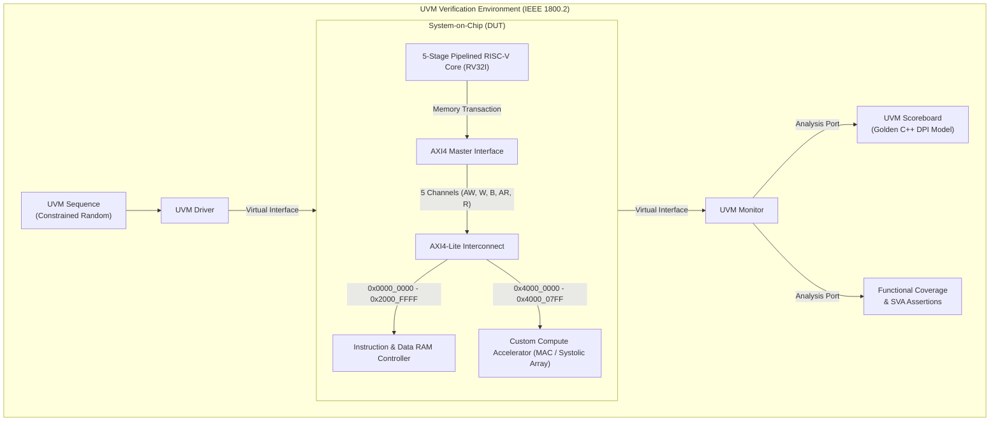

# Silicon Master Blueprint: Custom Hardware Accelerator + AXI Bus with UVM & SystemVerilog

> [!NOTE] **Target Profile**
> Designed for **Top 1% Undergraduate Silicon Architecture & Design Verification (DV) Candidates**.
> Aligned with Tier-1 industry hiring expectations at **Apple Silicon, NVIDIA, ARM, Qualcomm, AMD, and Intel**.

---

## Visual Architecture Map

---

## Master Vault Table of Contents

### Pillar 0: Foundations & Big Picture
*Start here if you are new to Computer Engineering or need a completely crystal-clear mental model.*
- [[01_Computer_Engineering_Zero_To_Hero| Computer Engineering From Absolute Zero]]: Transistors, clock cycles, binary, ALUs, memory, and how code turns into voltage.
- [[02_Executive_System_Architecture| Executive System Architecture]]: The high-level view of our entire chip, bus interconnect, memory map, and coprocessor interface.

---

### Pillar 1: The Pipelined RISC-V CPU Core (RV32I)
*The brain of our system: An industry-standard 32-bit open-source processor.*
- [[01_RISCV_RV32I_Architecture| RV32I Architecture & ISA Specification]]: Instructions (R, I, S, B, U, J types), registers `x0`-`x31`, and execution flow.
- [[02_Five_Stage_Pipelined_Core| 5-Stage Pipelined Datapath]]: Instruction Fetch (IF), Decode (ID), Execute (EX), Memory (MEM), and Writeback (WB).
- [[03_Hazards_Forwarding_and_Branch_Prediction| Hazard Detection, Forwarding & Branch Prediction]]: Resolving RAW data hazards, load-use bubbles, and branch flushes.
- [[04_NextGen_Architectural_Optimizations_Cache_DMA_RV32M| Silicon Optimization Blueprint: L1 Cache, DMA Engine & RV32M Extension]]: Detailed architectural specification resolving the memory wall, CPU data mover overhead, and software math latency.

---

### Pillar 2: AMBA AXI4-Lite Bus Protocol
*The industry standard highway for on-chip communication.*
- [[01_AMBA_AXI4_Lite_Protocol_Deep_Dive| AMBA AXI4-Lite Protocol Deep Dive]]: The courier postal system analogy, 5 independent channels, and the `VALID`/`READY` handshake law.
- [[02_AXI4_Lite_Master_and_Slave_Design| AXI4-Lite Master & Slave Implementation]]: State machines, address decoders, multiplexers, and response codes (`OKAY`, `SLVERR`, `DECERR`).

---

### Pillar 3: The Custom Compute Accelerator (Domain-Specific Silicon)
*The hardware engine that outperforms general-purpose CPUs on Matrix & AI workloads.*
- [[01_Custom_Compute_Accelerator_Concepts| Compute Accelerator Concepts]]: Why hardware acceleration matters, Matrix Multiplication math, and Q8.8 Fixed-Point arithmetic.
- [[02_Accelerator_Datapath_and_FSM| Accelerator Datapath, CSR Registers & Interrupt Flow]]: Control/Status registers (CSRs), processing elements, local SRAM, and CPU IRQ signaling.

---

### Pillar 4: SystemVerilog & UVM Verification Environment
*The elite skill set that commands top-tier industry compensation.*
- [[01_Verification_Fundamentals_Zero_To_Hero| Verification Fundamentals From Zero]]: Why chips fail, directed testing vs. constrained-random verification, and the cost of silicon bugs.
- [[02_SystemVerilog_Interfaces_and_SVA| SystemVerilog Interfaces & Assertions (SVA)]]: Clocking blocks, race-condition immunity, and formal protocol assertion checkers.
- [[03_UVM_Hierarchy_and_Components| UVM Architecture Hierarchy]]: Factory, Phases, `uvm_sequence`, `uvm_driver`, `uvm_monitor`, `uvm_agent`, and `uvm_env`.
- [[04_Scoreboard_and_DPI_C_Golden_Model| UVM Scoreboard & C++ DPI Golden Model]]: High-level mathematical reference predictors and automated transaction checking.
- [[05_Functional_Coverage_and_Closure| Functional Coverage & 100% Verification Closure]]: Covergroups, coverpoints, cross-coverage, and closing the verification loop.

---

### Hands-On Execution & Toolchain Labs
- [[01_Toolchain_Setup_and_Installation| Complete Toolchain Installation Guide]]: Free open-source (Verilator, Icarus, GTKWave, RISC-V GCC) + Industry (QuestaSim/VCS).
- [[01_Phase_1_RISCV_Core_Implementation| Phase 1 Execution: Building the RV32I Core]]: Code walkthrough, unit tests, and waveform verification.
- [[02_Phase_2_AXI_and_Accelerator_Implementation| Phase 2 Execution: Building AXI-Lite & Accelerator]]: Connecting CPU to memory and compute engine over AXI.
- [[03_Phase_3_UVM_Verification_Implementation| Phase 3 Execution: Building the UVM Testbench]]: Step-by-Step verification implementation and coverage closure.
- [[04_Phase_4_Baremetal_Firmware_and_CoVerification| Phase 4 Execution: Bare-Metal Firmware & HW/SW Co-Verification]]: Autonomous C/assembly driver execution, MMIO, interrupts, and mailbox verification.
- [[05_Tiled_GEMM_Algorithm_and_Hardware_Partitioning| Phase 4 Extension: 4x4 Tiled Block GEMM & Hardware Partitioning]]: Generic tensor partitioning, 8 coprocessor runs, partial-product accumulation.
- [[03_ASIC_Physical_Synthesis_Report| ASIC Synthesis Report]]: Yosys 0.33 gate-level synthesis (108,342 gates, 16,385 DFFs).
- [[02_Simulation_Scripts_and_Makefiles| Automated Makefiles & Regression Scripts]]: One-click compilation, test running, waveform dumping, and log parsing.

---

## Milestone Execution Tracker

| Phase | Module | Milestone Goal | Verification Gate | Status |
| :--- | :--- | :--- | :--- | :--- |
| **Phase 1** | **RV32I Core** | 5-stage pipelined CPU with Forwarding & Hazard Unit | 44/44 unit tests pass without stalls/corruptions | Completed |
| **Upgrade 3** | **RV32M Extension** | Hardware Multiplier & Divider (MUL/DIV/REM) in ALU | 32/32 tests pass, zero-divide & overflow compliant | Completed |
| **Phase 2.1** | **AXI4-Lite Bus** | Master/Slave wrappers & 5-channel handshake logic | 10/10 protocol tests pass without deadlocks | Completed |
| **Phase 2.2** | **Accelerator** | 4-MAC engine / Systolic array with Q8.8 fixed-point math | 13/13 computation & saturation checks pass | Completed |
| **Phase 2.3** | **SoC Integration** | CPU boots C code, programs accelerator over MMIO, handles IRQ | 12/12 integration checks pass | Completed |
| **Phase 3** | **UVM Environment** | Scoreboard, C++ golden predictor, functional coverage | 100% mathematical accuracy & coverage closure | Completed |
| **Phase 4** | **Firmware & Co-Verification** | Autonomous bare-metal firmware runs on silicon datapath | 13/13 checks pass, 0xCAFEBABE in RAM mailbox | Completed |
| **Phase 4 Ext**| **4x4 Tiled Block GEMM** | Generic block matrix partitioning over fixed 2x2 silicon | 10/10 checks pass, 8 coprocessor runs, 0xFEEDC0DE | Completed |
| **Synthesis** | **ASIC Physical Mapping** | Yosys technology mapping to CMOS logic cells | 108,342 gates, 16,385 DFFs, 0 latches | Completed |
| **Regression**| **CI/CD Test Suite** | Automated regression script running all 10 testbenches | 146/146 assertions pass across 10 testbenches | Completed |

---
*Tip: Click on any `[[Link]]` above to jump directly into the technical deep dive note.*
