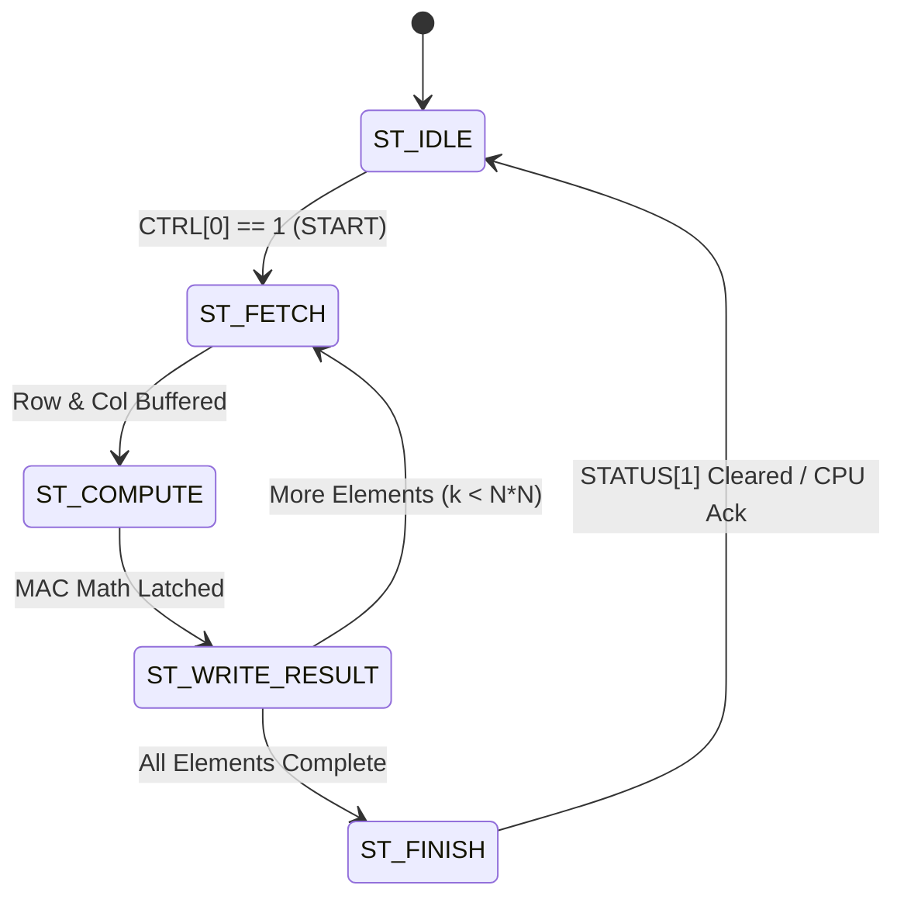

# Accelerator Datapath, CSR Registers, and FSM Microarchitecture

> [!TIP] **The Hardware-Software Contract**
> How does a CPU tell a hardware accelerator to start working?
> Through **Control & Status Registers (CSRs)**.
> Think of CSRs like the buttons and displays on a microwave oven:
> - You set the timer and power level (**Configuration Registers**).
> - You press the START button (**Control Register**).
> - While it cooks, the display shows "RUNNING" (**Status Register**).
> - When it finishes, it beeps loudly (**Hardware Interrupt Line / IRQ**)!

---

## 1. Complete CSR Memory Map (`0x4000_0000`)

The Accelerator peripheral responds to standard 32-bit AXI read and write transactions targeted within the `0x4000_0000` memory region.

| Address Offset | Register Name | Access | Bit Breakdown | Description |
| :---: | :--- | :---: | :--- | :--- |
| `0x00` | **`CTRL`** | R/W | `[0]`: `START` (Write 1 to trigger)<br>`[1]`: `IRQ_EN` (Enable interrupt on completion)<br>`[2]`: `SOFT_RESET` (Reset internal FSM)<br>`[31:3]`: Reserved | Main accelerator control register. |
| `0x04` | **`STATUS`** | Read-Only | `[0]`: `BUSY` (1 = hardware computing)<br>`[1]`: `DONE` (1 = execution finished)<br>`[2]`: `OVERFLOW` (1 = math saturated)<br>`[31:3]`: Reserved | Status indicators for CPU polling. |
| `0x08` | **`DIM`** | R/W | `[7:0]`: Matrix dimension $N$ (e.g. `4` for $4 \times 4$, `8` for $8 \times 8$). | Matrix size parameter. |
| `0x10` | **`SRC_A_PTR`** | R/W | `[15:0]`: Buffer offset where Matrix A begins (default `0x0100`). | Source A pointer. |
| `0x14` | **`SRC_B_PTR`** | R/W | `[15:0]`: Buffer offset where Matrix B begins (default `0x0200`). | Source B pointer. |
| `0x18` | **`DST_PTR`** | R/W | `[15:0]`: Buffer offset where Result C is stored (default `0x0300`). | Destination C pointer. |
| `0x0100 - 0x07FF` | **`LOCAL_RAM`** | R/W | High-speed dual-port scratchpad buffer storing raw Q8.8 matrices. | Internal matrix storage. |

---

## 2. The Compute Datapath: 4-Parallel MAC Bank

To multiply a $4 \times 4$ matrix, the datapath uses **4 parallel Multiply-Accumulate (MAC) units**:

```
 Matrix A: Row i Elements
 [A_0] [A_1] [A_2] [A_3]
 | | | |
Matrix B: v v v v
Col j Elements --> (X) (X) (X) (X) <-- 4 Parallel DSP Multipliers
 | | | |
 +----+----+----+----+
 |
 v
 +----------+
 | 4-Input |
 | Adder |
 | Tree |
 +----------+
 |
 v
 +----------+
 | ( + ) |<---+ (Accumulator Register)
 +----------+ |
 | |
 +----------+
 |
 v
 [ Saturation / Shift ]
 |
 v
 Result C[i][j] (Q8.8)
```

- In each clock cycle, the datapath loads 4 elements from Row $i$ of Matrix A and 4 elements from Column $j$ of Matrix B.
- All 4 multiplications occur simultaneously in hardware:
 $$\text{Partial Sum} = (A_{i0} \times B_{0j}) + (A_{i1} \times B_{1j}) + (A_{i2} \times B_{2j}) + (A_{i3} \times B_{3j})$$
- A single cell $C_{ij}$ of a $4 \times 4$ matrix is calculated in **just 1 clock cycle**!
- The entire $4 \times 4$ matrix ($16$ elements) is calculated in **only 16 compute cycles**!

---

## 3. Finite State Machine (FSM) Controller



### State Machine Breakdown:
1. **`ST_IDLE`**:
 - `STATUS[0] (BUSY) = 0`, `STATUS[1] (DONE) = 0`, `irq = 0`.
 - Listens for CPU writing `1` to `CTRL[0] (START)`.
2. **`ST_FETCH`**:
 - `STATUS[0] (BUSY) = 1`.
 - Generates read addresses to local scratchpad SRAM to fetch Row $i$ of Matrix A and Column $j$ of Matrix B.
3. **`ST_COMPUTE`**:
 - Feeds values into the 4-MAC multipliers and adder tree.
 - Evaluates Q8.8 fixed-point saturation logic.
4. **`ST_WRITE_RESULT`**:
 - Writes the resulting $C_{ij}$ value into the destination buffer offset `DST_PTR + (i*N + j)*2`.
 - Increments row/column counters ($j \leftarrow j+1$; if $j == N$, $j \leftarrow 0, i \leftarrow i+1$).
 - If all $N \times N$ elements are written, transitions to `ST_FINISH`.
5. **`ST_FINISH`**:
 - Asserts `STATUS[1] (DONE) = 1`.
 - De-asserts `STATUS[0] (BUSY) = 0`.
 - If `CTRL[1] (IRQ_EN)` is active, pulls the physical `irq` pin HIGH to alert the CPU!

---

## 4. Hardware-Software Flow: Real C Firmware Driver

Here is the exact, real-world C driver that runs on the RISC-V CPU to interact with our custom accelerator:

```c
#include <stdint.h>

// Base Addresses from Memory Map
#define ACCEL_BASE 0x40000000
#define REG_CTRL (*(volatile uint32_t *)(ACCEL_BASE + 0x00))
#define REG_STATUS (*(volatile uint32_t *)(ACCEL_BASE + 0x04))
#define REG_DIM (*(volatile uint32_t *)(ACCEL_BASE + 0x08))
#define REG_SRC_A (*(volatile uint32_t *)(ACCEL_BASE + 0x10))
#define REG_SRC_B (*(volatile uint32_t *)(ACCEL_BASE + 0x14))
#define REG_DST (*(volatile uint32_t *)(ACCEL_BASE + 0x18))
#define ACCEL_BUFFER ((volatile int16_t *)(ACCEL_BASE + 0x0100))

// Control Register Bits
#define CTRL_START (1 << 0)
#define CTRL_IRQ_EN (1 << 1)
#define STATUS_BUSY (1 << 0)
#define STATUS_DONE (1 << 1)

// Helper: Convert float to Q8.8 fixed-point
static inline int16_t float_to_q8_8(float val) {
 return (int16_t)(val * 256.0f);
}

// Helper: Convert Q8.8 fixed-point back to float
static inline float q8_8_to_float(int16_t val) {
 return ((float)val) / 256.0f;
}

void run_matrix_multiply(float A[4][4], float B[4][4], float C[4][4]) {
 // 1. Copy Input Matrices into Accelerator Local RAM
 volatile int16_t *buf_A = ACCEL_BUFFER; // Offset 0x0100
 volatile int16_t *buf_B = ACCEL_BUFFER + 16; // Offset 0x0120
 volatile int16_t *buf_C = ACCEL_BUFFER + 32; // Offset 0x0140

 for (int i = 0; i < 4; i++) {
 for (int j = 0; j < 4; j++) {
 buf_A[i * 4 + j] = float_to_q8_8(A[i][j]);
 buf_B[i * 4 + j] = float_to_q8_8(B[i][j]);
 }
 }

 // 2. Configure Accelerator Control Registers
 REG_DIM = 4; // 4x4 matrix
 REG_SRC_A = 0x0100;
 REG_SRC_B = 0x0120;
 REG_DST = 0x0140;

 // 3. Fire the Accelerator!
 REG_CTRL = CTRL_START | CTRL_IRQ_EN;

 // 4. Poll STATUS until DONE (or sleep waiting for hardware IRQ)
 while (REG_STATUS & STATUS_BUSY) {
 // CPU can do other work or execute WFI (Wait For Interrupt)
 }

 // 5. Read back results
 for (int i = 0; i < 4; i++) {
 for (int j = 0; j < 4; j++) {
 C[i][j] = q8_8_to_float(buf_C[i * 4 + j]);
 }
 }
}
```

---

## Next Steps
Now that the entire System-on-Chip hardware is specified, we enter the most critical domain in modern silicon engineering: **Verification with SystemVerilog and UVM**:
 [[01_Verification_Fundamentals_Zero_To_Hero|Proceed to Pillar 4: Verification Fundamentals]]
