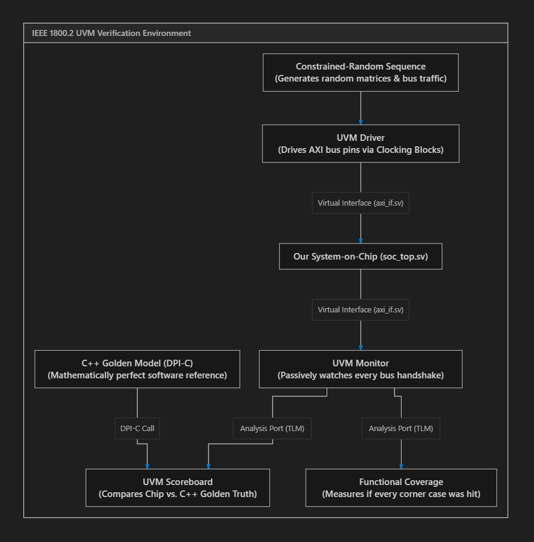

# Verification Fundamentals: From Zero to Constrained-Random Methodology

> [!NOTE] **The Economics of Silicon: Why DV Engineers Rule the Industry**
> In software development, testing is often an afterthought. If code crashes in production, you deploy a hotfix in 10 minutes.
> In silicon hardware engineering:
> - Printing masks for a 3nm or 5nm chip at TSMC costs **$20,000,000+**.
> - It takes **6 months** to manufacture physical silicon wafers.
> - If a chip arrives back from the fab with a single logical flaw, you cannot patch the metal wires. The entire company can go bankrupt from a **"Respin"** ($20M lost + 6 months delayed to market).
>
> That is why **70% of all engineering effort and budget in semiconductor companies is spent on Verification**!



---

## 1. The Death of Directed Testing

In your early college classes, how did you test a Verilog module?
You wrote a simple testbench:
```verilog
initial begin
 a = 5; b = 3; #10;
 a = 2; b = 8; #10;
 $display("Done testing!");
end
```

This is called **Directed Testing** (manually picking inputs you expect to work).

### Why Directed Testing Fails on Real Chips:
A modern SoC has billions of possible states:
- 32 general-purpose registers.
- 5 pipeline stages holding different instructions.
- 5 AXI channels with variable `READY` delays.
- Memory holding millions of words.

If you tried to write manual directed tests for every combination, it would take **100,000 years**! Even worse, human engineers only test scenarios they *already thought of*. Bugs hide in the dark, bizarre corner cases that no human would ever imagine.

---

## 2. The Modern Standard: Constrained-Random Verification (CRV)

Instead of manually writing inputs, modern verification engineers build an **intelligent robotic tester**:

```
+-------------------------------------------------------------+
| Constrained-Random Stimulus |
+-------------------------------------------------------------+
 |
 Random, but legally constrained transactions
 |
 v
 +-------------------------------+
 | DUT (Device Under Test) |
 +-------------------------------+
 |
 v
 +-------------------------------+
 | Automated Scoreboard Check |
 +-------------------------------+
```

### What does "Constrained-Random" mean?
- **Random**: The computer generates thousands of randomized numbers, delays, opcodes, and memory addresses.
- **Constrained**: We set legal boundary rules so the random generator doesn't produce complete gibberish:
 - *"Generate random instructions, but make sure 30% are Loads, 30% are Stores, and 40% are Branches."*
 - *"Randomize the `READY` latency between 0 and 5 clock cycles to simulate memory backpressure."*
 - *"Ensure matrix inputs occasionally hit corner cases: `0x0000` (zero), `0x7FFF` (maximum positive), and `0x8000` (maximum negative)."*

By running 100,000 randomized transactions overnight across a computing cluster, CRV uncovers obscure bugs in hours that would take human testers months to find!

---

## 3. Why SystemVerilog (IEEE 1800) Replaced Plain Verilog

Standard Verilog (created in 1984) was designed only for describing digital hardware circuits. It lacked object-oriented programming, dynamic memory, and randomization.

**SystemVerilog** unified hardware description with high-level software capabilities:

### A. Object-Oriented Classes (`class`)
You can define transactions as reusable software objects with inheritance, polymorphism, and methods:
```systemverilog
class axi_transaction;
 rand bit [31:0] addr;
 rand bit [31:0] data;
 rand bit [3:0] strb;
 rand int delay_cycles;

 // Constraints guide the randomization engine!
 constraint c_aligned_addr {
 addr[1:0] == 2'b00; // Must be 4-byte word-aligned!
 }

 constraint c_reasonable_delay {
 delay_cycles inside {[0:5]};
 }
endclass
```

### B. Randomization Engine (`randomize()`)
With a single call, SystemVerilog's built-in solver generates mathematically valid random values satisfying all constraints:
```systemverilog
axi_transaction tr = new();
if (!tr.randomize()) begin
 $error("Randomization failed!");
end
```

### C. SystemVerilog Interfaces (`interface`)
Bundles hundreds of individual wire connections into a clean, reusable object with built-in timing blocks and protocol assertions.

---

## 4. The 3 Pillars of Silicon Verification

To claim that a silicon design is verified, three conditions must be satisfied:

1. **Stimulus Generation**: Can our testbench generate every legal, illegal, and corner-case scenario?
2. **Self-Checking (Scoreboard)**: Does the testbench automatically detect errors without a human having to look at waveforms?
3. **Coverage Metrics**: Can we mathematically prove that 100% of all features, branches, hazards, and states were tested?

---

## Next Steps
Let's see how SystemVerilog interfaces eliminate timing race conditions and enforce protocol rules with SystemVerilog Assertions:
 [[02_SystemVerilog_Interfaces_and_SVA|Proceed to SystemVerilog Interfaces & Assertions (SVA)]]
