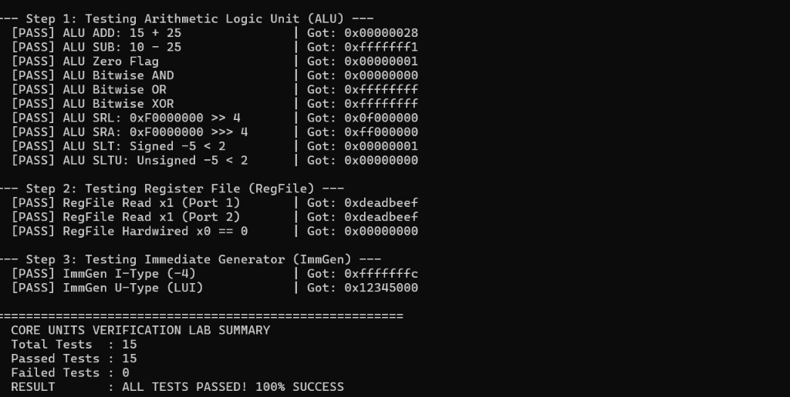
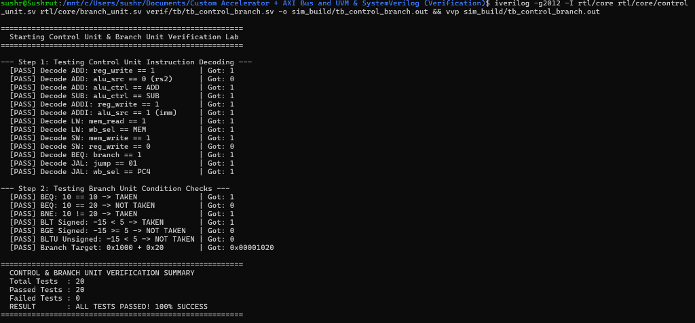

# Phase 1 Execution Plan: Building the 5-Stage Pipelined RV32I Core

> [!NOTE] **Goal of Phase 1**
> By the end of this phase, you will have a fully working, synthesizable **5-Stage Pipelined RISC-V RV32I Processor** that natively resolves data hazards via forwarding, stalls on load-use dependencies, flushes on branch mispredictions, and runs standard RISC-V assembly programs.

---

## Recommended RTL Directory Layout

```
rtl/
└── core/
 ├── riscv_defines.svh # Opcode, funct3, and ALU control parameters
 ├── alu.sv # 32-bit Arithmetic Logic Unit
 ├── regfile.sv # 32x32-bit dual-read single-write register file
 ├── imm_gen.sv # Immediate value generator for I, S, B, U, J types
 ├── control_unit.sv # Opcode decoder and pipeline control bus
 ├── hazard_unit.sv # Load-use hazard detection and stall bubble generator
 ├── forwarding_unit.sv # RAW hazard detection and ALU bypass mux control
 ├── branch_unit.sv # Branch condition comparator and target adder
 ├── pipe_if_id.sv # Pipeline register: Fetch to Decode
 ├── pipe_id_ex.sv # Pipeline register: Decode to Execute
 ├── pipe_ex_mem.sv # Pipeline register: Execute to Memory
 ├── pipe_mem_wb.sv # Pipeline register: Memory to Writeback
 └── rv32i_core_top.sv # Top-level processor wrapper
```

---

## Day-by-Day Implementation Roadmap

### Day 1–3: Fundamental Combinational Units
- [ ] **Step 1.1**: Create `riscv_defines.svh` with constant parameters for opcodes (`OP_IMM = 7'b0010011`, `OP_REG = 7'b0110011`, etc.).
- [ ] **Step 1.2**: Implement `alu.sv`. Write a quick Verilog testbench verifying all 10 ALU operations (`ADD`, `SUB`, `SLL`, `SLT`, `SLTU`, `XOR`, `SRL`, `SRA`, `OR`, `AND`).
- [ ] **Step 1.3**: Implement `regfile.sv`. Ensure `x0` remains permanently zero even when a write is attempted!
- [ ] **Step 1.4**: Implement `imm_gen.sv`. Verify sign extension on negative 12-bit and 20-bit immediates.

---

### Day 4–7: The Pipeline Registers & Control Unit
- [ ] **Step 1.5**: Implement the 4 synchronous pipeline registers (`pipe_if_id`, `pipe_id_ex`, `pipe_ex_mem`, `pipe_mem_wb`).
- [ ] **Step 1.6**: Add synchronous `stall` and `flush` control pins to `pipe_if_id` and `pipe_id_ex`.
 - On `stall == 1`: Hold register contents unchanged.
 - On `flush == 1`: Replace instruction with `0x0000_0013` (`NOP: addi x0, x0, 0`).
- [ ] **Step 1.7**: Implement `control_unit.sv` using the truth table in [[02_Five_Stage_Pipelined_Core#4-main-control-unit-truth-table|Control Unit Truth Table]].

---

### Day 8–10: Hazard Detection & Data Forwarding
- [ ] **Step 1.8**: Implement `forwarding_unit.sv`.
 - Detect `EX/MEM` RAW hazard $\rightarrow$ set `forward_a/b = 2'b10`.
 - Detect `MEM/WB` RAW hazard $\rightarrow$ set `forward_a/b = 2'b01`.
- [ ] **Step 1.9**: Implement `hazard_unit.sv`.
 - Detect `ID/EX.MemRead && (ID/EX.rd == IF/ID.rs1 || ID/EX.rd == IF/ID.rs2)`.
 - Assert `stall_pc = 1`, `stall_if_id = 1`, `flush_id_ex = 1`.

---

### Day 11–14: Branch Unit & Core Top Integration
- [ ] **Step 1.10**: Connect all blocks inside `rv32i_core_top.sv`.
- [ ] **Step 1.11**: Implement static **Predict-Not-Taken** branch logic:
 - If branch taken in EX stage: assert `flush_if_id = 1`, `flush_id_ex = 1`, set $\text{PC} \leftarrow \text{target}$.
- [ ] **Step 1.12**: Write a verification test assembly program containing:
 ```assembly
 # Test Forwarding & Stalls
 addi x1, x0, 10
 addi x2, x0, 20
 add x3, x1, x2 # Tests EX/MEM forwarding
 sw x3, 0(x0) # Store 30 into RAM[0]
 lw x4, 0(x0) # Load 30 into x4
 addi x5, x4, 5 # Tests Load-Use Hazard Stall (Result should be 35!)
 ```
- [ ] **Step 1.13**: Run simulation. Inspect waveforms in GTKWave to confirm the 1-cycle bubble appears and `x5` correctly updates to 35.

---

## Phase 1 Verification Gate
Your Phase 1 is complete when:
1. The hazard bubble correctly freezes the PC and IF/ID for 1 clock cycle.
2. Back-to-back ALU operations forward results without pipeline stalls.
3. Branch taken flushes exactly 2 instructions and jumps to the target address.
4. All 32 general-purpose registers update with mathematically correct answers.




---

## Next Steps
 [[02_Phase_2_AXI_and_Accelerator_Implementation|Proceed to Phase 2: AXI Bus & Accelerator Implementation]]
