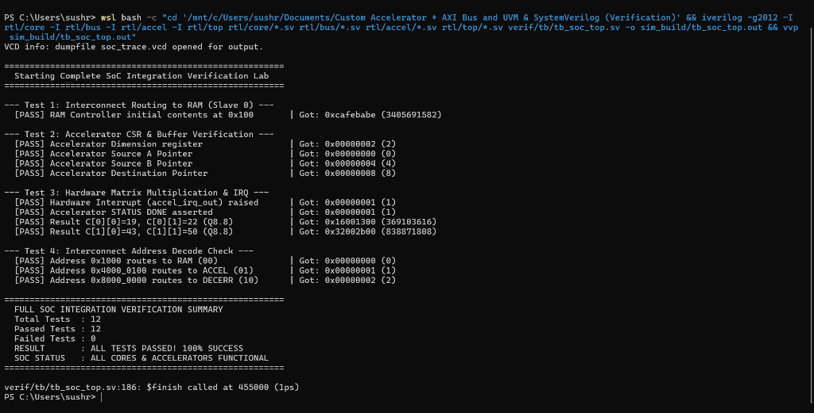

# Phase 2 Execution Plan: AXI Bus, Accelerator & SoC Integration

> [!NOTE] **Goal of Phase 2**
> Connect the CPU to real memory and a hardware compute engine using the **AMBA AXI4-Lite** standard. Write a real C program that boots on the CPU, programs the accelerator over Memory-Mapped I/O (MMIO), and executes a hardware-accelerated matrix multiplication!

---

## Recommended Module Layout

```
rtl/
├── bus/
│ ├── axi_lite_master.sv # Bridges CPU memory requests to AXI4-Lite
│ ├── axi_interconnect.sv # Address decoder, crossbar multiplexer & DECERR
│ └── axi_ram_ctrl.sv # AXI4-Lite synchronous SRAM controller
├── accel/
│ ├── accel_csr.sv # Control & Status Registers (0x4000_0000)
│ ├── accel_buffer.sv # Dual-port SRAM buffer (0x4000_0100 - 0x07FF)
│ ├── mac_unit.sv # Q8.8 fixed-point signed MAC with saturation
│ ├── accel_fsm.sv # Matrix execution sequencer
│ └── accel_top.sv # Top-level accelerator wrapper
└── top/
 └── soc_top.sv # Integrates CPU + AXI + RAM + Accelerator
```

---

## Day-by-Day Implementation Roadmap

### Day 1–4: AXI4-Lite Master & RAM Slave
- [ ] **Step 2.1**: Implement `axi_lite_master.sv` following the 5-state FSM described in [[02_AXI4_Lite_Master_and_Slave_Design|AXI Master Design]].
- [ ] **Step 2.2**: Implement `axi_ram_ctrl.sv`. Connect it to an on-chip dual-port SRAM holding 64 KB of program code and data.
- [ ] **Step 2.3**: Verify basic CPU-to-RAM access over AXI: execute `SW` (Store Word) and `LW` (Load Word) across the AXI bus and ensure `OKAY (2'b00)` responses.

---

### Day 5–8: Custom Compute Accelerator
- [ ] **Step 2.4**: Implement `mac_unit.sv`.
 - Takes two 16-bit signed Q8.8 inputs.
 - Computes 32-bit product, right-shifts by 8, adds accumulator.
 - Implements saturation clamping between `-128.0 (0x8000)` and `+127.996 (0x7FFF)`.
- [ ] **Step 2.5**: Implement `accel_csr.sv` with the register map from [[02_Accelerator_Datapath_and_FSM|CSR Registers]]:
 - `0x00`: `CTRL` (`START`, `IRQ_EN`, `SOFT_RESET`).
 - `0x04`: `STATUS` (`BUSY`, `DONE`, `OVERFLOW`).
 - `0x08`: `DIM` (Matrix size).
- [ ] **Step 2.6**: Implement `accel_fsm.sv` to coordinate reading row/column vectors from `accel_buffer.sv`, running the 4 MAC units, and writing results back to the destination buffer.
- [ ] **Step 2.7**: Wire up the `irq` interrupt line from `accel_top.sv`.

---

### Day 9–11: AXI Interconnect Crossbar
- [ ] **Step 2.8**: Implement `axi_interconnect.sv`:
 - Decode `AWADDR` / `ARADDR`:
 - `0x0000_0000 - 0x2000_FFFF` $\rightarrow$ Route to RAM Controller.
 - `0x4000_0000 - 0x4000_07FF` $\rightarrow$ Route to Accelerator.
 - Any other address $\rightarrow$ Route to internal dummy slave that returns `DECERR (2'b11)`!

---

### Day 12–14: SoC Integration & C Firmware Boot
- [ ] **Step 2.9**: Assemble the complete chip inside `soc_top.sv`.
- [ ] **Step 2.10**: Write the C firmware application (`main.c`) utilizing the C driver from [[02_Accelerator_Datapath_and_FSM#4-hardware-software-flow-real-c-firmware-driver|Firmware Driver]]:
 1. Populate matrices $A$ and $B$.
 2. Write configuration to accelerator CSRs.
 3. Assert `START = 1`.
 4. Wait for interrupt or poll `DONE == 1`.
 5. Read back result matrix $C$.
- [ ] **Step 2.11**: Cross-compile C code to binary hex using `riscv64-unknown-elf-gcc`:
 ```bash
 riscv64-unknown-elf-gcc -march=rv32i -mabi=ilp32 -nostdlib -T link.ld main.c -o soc_app.elf
 riscv64-unknown-elf-objcopy -O verilog soc_app.elf mem_init.hex
 ```
- [ ] **Step 2.12**: Load `mem_init.hex` into the RAM module (`$readmemh("mem_init.hex", ram_memory)`). Run simulation and verify that the SoC finishes the matrix multiplication!

---

## Phase 2 Verification Gate
Your Phase 2 is complete when:
1. The CPU successfully performs read and write transactions through the AXI4-Lite bus without deadlocks.
2. The interconnect correctly responds with `DECERR` if an invalid address is accessed.
3. The custom accelerator calculates a $4 \times 4$ matrix multiplication in hardware and asserts its `irq` pin.
4. The C program successfully reads back the correct mathematical output from the accelerator buffer!



---

## Next Steps
 [[03_Phase_3_UVM_Verification_Implementation|Proceed to Phase 3: UVM Testbench Implementation]]
